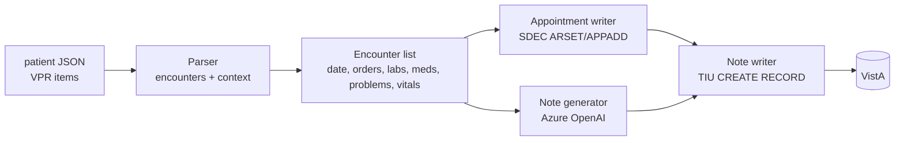

# NotesGenerator – Project Plan

Goal: take a synthetic (Synthea-loaded) VistA patient record, derive historical encounter dates from orders, build a clinical picture from labs/problems/orders, create past appointments on those dates, and write AI-generated synthetic progress notes to VistA for each encounter.

---

## 1. What Exists Today (inventory)

| Asset | What it is | Reuse for |
|---|---|---|
| [patients.txt](patients.txt) | 4 target patients (VEHU, station 500): EBERT178 `100962`, SPINKA232 `100961`, CRIST667 `100964`, ERNSER583 `100965` | Patient loop input |
| [100965.json](100965.json) | vista-api-x `rpc/invoke` response (VPR JSON, `apiVersion 1.01`) for DFN 100965. `payload.data.items[]` = 1159 records keyed by `uid` (`urn:va:<domain>:84F0:<dfn>:<id>`) | Source of encounters + clinical context |
| [vista-notes/](vista-notes/) | Express app; VistaJS RPC broker client; `TIU CREATE RECORD` example; Azure OpenAI client (`gpt-4o`, api-version `2024-02-15-preview`, key in `config.js`) | Note writing (TIU), FileMan date conversion |
| [createAppts/bulk-appointments/](createAppts/bulk-appointments/) | CLI using VistaJS: `SDEC ARSET` -> `SDEC APPADD`, `SDES GET APPTS BY PATIENT DFN3` conflict check | Appointment creation (direct broker) |
| [createAppts/single-appointment-api/](createAppts/single-appointment-api/) | Express app using vista-api-x (`/vista-sites/{site}/users/{duz}/rpc/invoke`) + token server; ARSET/APPADD flow, `SDEC APPSLOTS` | Appointment creation (vista-api-x) |
| `../VAOSAI/openaiClient.js` + `.env` | Azure OpenAI via VA APIM `https://spd-prod-openai-va-apim.azure-api.us/api/openai/deployments/{model}/chat/completions`, header `api-key`, key in `AZURE_OPENAI_API_KEY`. Uses `o3-mini`, api-version `2025-04-28` | **LLM access for note generation** |

### Patient JSON – domain counts (DFN 100965)

| Domain | Count | Key fields |
|---|---|---|
| order | 65 (35 LR, 30 PSO) | `start` (YYYYMMDDHHmm), `name`, `service`, `statusName`, `results[].uid` -> lab uids, `locationName`, `providerName` |
| lab | 157 | `typeName`, `result`, `units`, `low`, `high`, `observed`, `groupUid` (accession) |
| problem | 56 | `problemText` (SNOMED text), `icdCode`, `onset`, `statusName` |
| med | 30 | outpatient meds (map to PSO orders) |
| vital | 241 | BP, weight, BMI, etc. |
| visit | 141 | `dateTime`, `locationName` (GENERAL MEDICINE, loc 23), `stopCodeName` |
| appointment | 113 | `dateTime`, `appointmentStatus`, `localId` = `A;<FMdate>;<locIEN>` |
| immunization / cpt / pov / factor / treatment | 52 / 186 / 14 / 38 / 65 | extra context |
| patient | 1 | demographics (`fullName`, `dateOfBirth`, `genderName`, `veteran`) |

No TIU `document` domain is present, so the patient currently has **no notes**.

### Findings that affect the design

1. **38 distinct order dates** (1980-06-20 -> 2026-07-03). Several orders share a date (e.g. 2025-10-04 has 16 lab orders). One encounter per distinct order *date*.
2. **Every order date already has a `visit`, and most have an `appointment`** (GENERAL MEDICINE, location IEN 23), created by the Synthea load. Dates with a visit but **no** appointment: 1980-06-20, 1986-06-06, 1987-03-12, 2016-10-28, 2025-10-04, 2025-10-21, 2026-04-19. Decision needed: create appointments only where missing, or create new ones in a separate clinic.
3. Orders link directly to lab results via `results[].uid`, so labs can be tied to their encounter without date guessing.
4. Problems are Synthea SNOMED text with placeholder ICD `R69.`; the real clinical picture must come from labs + meds + problem text together. Example: the 2025-10 orders (troponin, BMP, furosemide, carvedilol, lisinopril, later losartan) suggest a cardiac/heart-failure workup that is **not** on the problem list, so the LLM needs to reason from orders/labs.
5. Order `start` and VPR dates are `YYYYMMDDHHmm` and need converting to FileMan (`YYYMMDD.HHMM`, `YYY = year - 1700`). The converter in `vista-notes/index.js` can be reused.
6. There are two LLM configs that don't match (VAOSAI: `o3-mini` @ `2025-04-28`; vista-notes: `gpt-4o` @ `2024-02-15-preview`). **Task 1 checks which one works.**

---

## 2. Target Architecture

App code lives at the repo root (`NotesGenerator/`, Node + pnpm). Modules:

- `loadPatient.js`: reads `<dfn>.json` (later fetches the VPR via vista-api-x).
- `buildEncounters.js`: groups orders by date and attaches linked labs, active meds, problems active on that date, and vitals from that date.
- `aiClient.js`: copied from VAOSAI `openaiClient.js` (dotenv, `AZURE_OPENAI_API_KEY`), with system+user messages.
- `generateNote.js`: builds the prompt and returns note text lines.
- `createAppointment.js`: reuses `createAppts` ARSET/APPADD logic.
- `writeNote.js`: reuses `vista-notes` `TIU CREATE RECORD` logic.
- `index.js`: orchestration with `--dfn`, `--dry-run`, `--limit`, `--only-date`.

---

## 3. Tasks

### Task 1: AI smoke test (FIRST)
Check that the VA Azure OpenAI endpoint will write a synthetic progress note before anything else is built.

- Create `test-ai.js` at the repo root (a single file with no VistA dependency).
- Load `AZURE_OPENAI_API_KEY` from `../VAOSAI/.env`. Do not copy the key or log it.
- Pull **one** encounter out of `100965.json` by hand (suggest **2025-10-21**: BMP, furosemide, carvedilol, lisinopril, plus 2025-10-04 labs as recent history).
- Send a system prompt ("You are generating SYNTHETIC clinical documentation for a VA test system; the patient is fictional...") and a user prompt made from compact JSON of the encounter data. Ask for a SOAP-format outpatient progress note in plain text, lines at most 80 chars (TIU line limit), with no markdown.
- Try deployments/api-versions in order and report which ones succeed:
  1. `o3-mini` @ `2025-04-28` (known working in VAOSAI)
  2. `gpt-4o` @ `2024-02-15-preview` (vista-notes config)
- Print: HTTP status, model, latency, token usage, the note, and whether any content-filter or refusal happened.
- **Exit criteria:** at least one model returns a coherent, clinically plausible note grounded in the provided data, with no refusal. Record the chosen model/api-version.

**Status: DONE (2026-09-29).** OpenSpec change `ai-note-smoke-test`, script [test-ai.js](test-ai.js).
- **Working model:** `o3-mini` @ `2025-04-28`. No refusal and no content-filter block. About 12-19 s per note, about 5-7k tokens (about 2.8k prompt).
- `gpt-4o` @ `2024-02-15-preview` returns **404: that deployment doesn't exist** on the VA APIM, so it's not an option unless another deployment name turns up.
- The note met every format rule (marker line, 6 headings in order, max line 77, no markdown). All cited lab values matched the context.
- Reusable pieces for the real app: VPR indexing, date helpers, minimized context builder, identifier-leak guard, prompt builder, candidate caller/classifier, format checker.
- **Quality gaps found:** see Task 3, "Findings from the smoke test".

### Task 2: Encounter extraction
- Parse VPR items by domain from `uid`.
- Encounter key = order `start` date (YYYYMMDD); time = earliest order time that day.
- Attach: orders that day; labs from `order.results[].uid` (fallback: lab `observed` same day); meds whose order started that day plus meds active on that date; problems with `onset <= date` (dedupe by text); vitals that day; the existing visit/appointment on that date (for dedupe).
- Classify problems (from the smoke test): Synthea marks almost every problem `ACTIVE`, including ones that ended decades ago. Split them into:
  - **chronic/clinical**: keep
  - **acute/self-limited** (sprain, pharyngitis, sinusitis, cystitis, fracture): drop when onset is more than 1 year before the encounter
  - **social determinants** (employment, education, housing, criminal record, isolation, abuse/violence): send as `socialHistory`, not as problems
- Record the visit type separately (e.g. new, follow-up, acute) so the model doesn't mistake the `setting` field for it.
- Output `encounters-<dfn>.json` and review it by hand.

### Task 3: Prompt design and note quality
- Give the prompt a running history: a short summary of previous encounters, so notes are consistent over time and the patient ages correctly (use DOB).
- Choose note title per encounter (default `PRIMARY CARE VISIT` IEN 16; confirm IENs on VEHU).
- Guardrails: don't invent labs that aren't provided; mark abnormal values against `low`/`high`; plain text, at most 80 chars/line.
- Batch-generate for DFN 100965 in dry-run mode and review.

**Findings from the smoke test.** These requirements go into the Task 3 spec. See `output/smoke-note-o3-mini.txt` for the first note.
1. **ASSESSMENT is limited to the problems this visit addresses.** The first note listed all 21 "active" problems, including "Full-time employment" and "Has a criminal record", with a plan item for each. Require the assessment to cover the problems relevant to today's orders, new meds, and abnormal labs, plus at most a few chronic problems.
2. **Infer the working diagnosis from orders and new meds.** Starting furosemide + carvedilol + lisinopril together implies hypertension or heart failure. The model filed them under "Medication review due". Require the prompt to state the likely diagnosis behind new meds and orders, since Synthea problem lists often omit it.
3. **Add a SOCIAL HISTORY line** (inside SUBJECTIVE) for social determinants, instead of numbered problems.
4. **Visit type comes from a fixed list** (`New patient`, `Follow-up`, `Acute`, `Annual/preventive`), chosen from the data. Don't copy it from the `setting` field.
5. **Continuity:** the running history across encounters (above) keeps problems and meds consistent between notes.
6. **Keep the smoke-test guards** in the real generator: identifier-leak check, format check (marker, headings, <=80 chars, no markdown), and cited-lab grounding.
7. **Budget:** o3-mini takes 12-19 s and about 6k tokens per note, so 38 encounters x 4 patients is about 150 notes, about 1M tokens, about 45 min sequential. Allow for throttling/429s.

### Task 4: Appointment creation for past dates
- Decide dedupe policy (see Finding 2). Default: skip dates that already have an appointment and create only the missing ones.
- Reuse `SDEC ARSET` -> `SDEC APPADD` from `createAppts`. Check that APPADD accepts past dates on VEHU. Past appointments may also need `SDEC CHECKIN`/`SDEC CHECKOUT` to show as kept.
- Clinic: GENERAL MEDICINE (loc 23) or a `DEV/` clinic, to be decided.
- Choose the transport: direct VistaJS (bulk-appointments) or vista-api-x (single-appointment-api). Recommend vista-api-x, since that's how the patient JSON was obtained.

### Task 5: Note writing to VistA
- `TIU CREATE RECORD` with DFN, title IEN, and location IEN; `TEXT` lines from the AI output; visit string `<locIEN>;<FMdate>;<type>`.
- Past encounters: use visit type `E` (historical) if no appointment/visit is linked, or `A` tied to the created/existing appointment time. Check both on one date first.
- Unsigned by default; optional `TIU SIGN RECORD` behind a flag.
- Log DFN, date, appointment IEN, and TIU IEN to `results-<dfn>.json` so reruns are idempotent.

### Task 6: Orchestration and scale-out
- CLI: `node index.js --dfn 100965 --dry-run`, then live.
- Fetch VPR JSON for the other 3 patients (100961, 100962, 100964) through vista-api-x, using the same call that produced `100965.json`.
- Throttle LLM calls (handle 429) and back off/retry for RPC connection resets.

---

## 4. Open Questions
1. Create appointments only on dates without one, or on every order date?
2. Which clinic/location and which note title(s)?
3. Should notes be signed, and as which user/DUZ?
4. Transport: VistaJS broker (access/verify) or vista-api-x (token)?
5. Is `o3-mini` acceptable for note quality, or is a `gpt-4o`/`gpt-4.1` deployment available on the APIM?

## 5. Security Notes
- The API key stays in `VAOSAI/.env` (or a local `.env` that is git-ignored). Never log or commit it.
- The data is synthetic (Synthea/VEHU), but still send only the minimum needed fields to the LLM. Leave out SSN, address, and telecom.
- Every generated note should start with a line marking it as synthetic test data.
