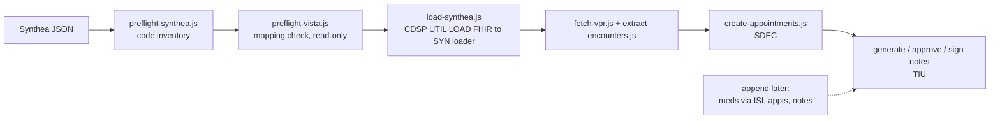
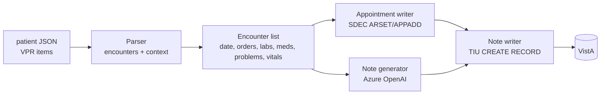

# NotesGenerator – Project Plan

Goal: take a synthetic (Synthea) patient, load it into VistA, derive historical encounter dates from the loaded orders, build a clinical picture from labs/problems/orders/meds, create past appointments on those dates, and write AI-generated synthetic progress notes to VistA for each encounter. Later additions (appointments, meds, notes) are appended to existing patients.

---

## 0. Current state and load path (2026-10-06)

**Decision:** hybrid. The initial load uses the VistA FHIR Data Loader (SYN), with local patches; appends use the
VistA Data Loader RPCs (`ISI IMPORT *`) where they fit, plus our own SDEC (appointments) and TIU (notes) tools.
See [docs/DECISION-LOAD-PATH.md](docs/DECISION-LOAD-PATH.md).

**Priorities (owner):** notes, labs, meds, problems, appointments. Vitals and procedures are low priority. Specialty and ED
encounters are wanted (everything is currently GENERAL MEDICINE).

| Area | Status |
|---|---|
| Notes pipeline (Tasks 1-6) | Done; 444 notes for 4 patients plus 23 for DFN 100969 (TORPHY630,LAN153), all signed |
| Lab values in notes | Fixed 2026-10-05: lab names were missing from the prompt; labs are now rendered from data and a pairing check flags mismatches |
| Synthea load (OpenSpec `synthea-fhir-rpc-loader`) | RPCs built and working (`LOAD`, `LOG`, `PREFLIGHT`); one full patient loaded; gap analysis done; fixes not yet applied (Task 13) |
| Specialty / ED encounters | Working: `CDSPENC` plus one `SYNFENC` line (`patches/synfenc-location.txt`) loaded on dev; tested on DFN 100970 (ED, CARDIOLOGY and DENTAL visits landed in their clinics; notes and appointments created and signed) (Task 13) |
| Append path | Appointments and notes built; appointments choose the clinic from the visit location (`src/clinic-lookup.json`); meds `ADDRX` written but PARKED (Task 14) |
| Multiple providers | Not started (Task 12) |

---

## 1. Original inventory (historical, from project start)

This section records what existed when the project began. Several folders listed here (`vista-notes/`,
`createAppts/`) are no longer in the repo; their logic now lives in `src/` (see section 2).

| Asset | What it is | Reuse for |
|---|---|---|
| [patients.txt](patients.txt) | 4 target patients (VEHU, station 500): EBERT178 `100962`, SPINKA232 `100961`, CRIST667 `100964`, ERNSER583 `100965` | Patient loop input |
| [100965.json](100965.json) | vista-api-x `rpc/invoke` response (VPR JSON, `apiVersion 1.01`) for DFN 100965. `payload.data.items[]` = 1159 records keyed by `uid` (`urn:va:<domain>:84F0:<dfn>:<id>`) | Source of encounters + clinical context |
| [vista-notes/](vista-notes/) | Express app; VistaJS RPC broker client; `TIU CREATE RECORD` example; Azure OpenAI client (`gpt-4o`, api-version `2024-02-15-preview`, key in `config.js`) | Note writing (TIU), FileMan date conversion |
| [createAppts/bulk-appointments/](createAppts/bulk-appointments/) | CLI using VistaJS: `SDEC ARSET` -> `SDEC APPADD`, `SDES GET APPTS BY PATIENT DFN3` conflict check | Appointment creation (direct broker) |
| [createAppts/single-appointment-api/](createAppts/single-appointment-api/) | Express app using vista-api-x (`/vista-sites/{site}/users/{duz}/rpc/invoke`) + token server; ARSET/APPADD flow, `SDEC APPSLOTS` | Appointment creation (vista-api-x) |
| `../VAOSAI/openaiClient.js` + `.env` | Azure OpenAI via VA APIM `https://spd-prod-openai-va-apim.azure-api.us/api/openai/deployments/{model}/chat/completions`, header `api-key`, key in `AZURE_OPENAI_API_KEY`. Uses `o3-mini`, api-version `2025-04-28` | **LLM access for note generation** |

### Patient JSON – domain counts (DFN 100965)

| Domain | Count | Key fields |
|---|---|---|
| order | 65 (35 LR, 30 PSO) | `start` (YYYYMMDDHHmm), `name`, `service`, `statusName`, `results[].uid` -> lab uids, `locationName`, `providerName` |
| lab | 157 | `typeName`, `result`, `units`, `low`, `high`, `observed`, `groupUid` (accession) |
| problem | 56 | `problemText` (SNOMED text), `icdCode`, `onset`, `statusName` |
| med | 30 | outpatient meds (map to PSO orders) |
| vital | 241 | BP, weight, BMI, etc. |
| visit | 141 | `dateTime`, `locationName` (GENERAL MEDICINE, loc 23), `stopCodeName` |
| appointment | 113 | `dateTime`, `appointmentStatus`, `localId` = `A;<FMdate>;<locIEN>` |
| immunization / cpt / pov / factor / treatment | 52 / 186 / 14 / 38 / 65 | extra context |
| patient | 1 | demographics (`fullName`, `dateOfBirth`, `genderName`, `veteran`) |

No TIU `document` domain is present, so the patient currently has **no notes**.

### Findings that affect the design

1. **38 distinct order dates** (1980-06-20 -> 2026-07-03). Several orders share a date (e.g. 2025-10-04 has 16 lab orders). One encounter per distinct order *date*.
2. **Every order date already has a `visit`, and most have an `appointment`** (GENERAL MEDICINE, location IEN 23), created by the Synthea load. Dates with a visit but **no** appointment: 1980-06-20, 1986-06-06, 1987-03-12, 2016-10-28, 2025-10-04, 2025-10-21, 2026-04-19. Decision needed: create appointments only where missing, or create new ones in a separate clinic.
3. Orders link directly to lab results via `results[].uid`, so labs can be tied to their encounter without date guessing.
4. Problems are Synthea SNOMED text with placeholder ICD `R69.`; the real clinical picture must come from labs + meds + problem text together. Example: the 2025-10 orders (troponin, BMP, furosemide, carvedilol, lisinopril, later losartan) suggest a cardiac/heart-failure workup that is **not** on the problem list, so the LLM needs to reason from orders/labs.
5. Order `start` and VPR dates are `YYYYMMDDHHmm` and need converting to FileMan (`YYYMMDD.HHMM`, `YYY = year - 1700`). The converter in `vista-notes/index.js` can be reused.
6. There are two LLM configs that don't match (VAOSAI: `o3-mini` @ `2025-04-28`; vista-notes: `gpt-4o` @ `2024-02-15-preview`). **Task 1 checks which one works.**

---

## 2. Notes Pipeline Architecture

App code lives at the repo root (`NotesGenerator/`, Node + pnpm): root files are CLI entry points, `src/` holds shared modules. Current layout:

- Load and diagnose: `load-synthea.js`, `fetch-load-log.js`, `preflight-synthea.js`, `preflight-vista.js`; `src/fhirBundleTransport.js`.
- Patient data and encounters: `fetch-vpr.js`, `extract-encounters.js`; `src/encounters.js`, `src/problem-rules.json`.
- Appointments: `create-appointments.js`; `src/appointmentCreator.js`.
- Notes: `generate-notes.js`, `approve-note.js`, `sign-notes.js`, `resign-notes.js`; `src/noteGenerator.js`, `src/labBlock.js`, `src/noteFlags.js`, `src/reflow.js`, `src/noteStore.js`, `src/notesClient.js`; prompt and validation in `test-ai.js`.
- Transport and auth: `src/vistaApiClient.js`, `src/tokenService.js`, `src/config.js`.
- Manual smoke tests: `test-ai.js`, `test-create-appointment.js`, `test-write-note.js`.

The module plan originally written here (`loadPatient.js`, `buildEncounters.js`, `index.js`, and so on) was replaced by these discrete, idempotent scripts.

---

## 3. Tasks

### Task 1: AI smoke test (FIRST)
Check that the VA Azure OpenAI endpoint will write a synthetic progress note before anything else is built.

- Create `test-ai.js` at the repo root (a single file with no VistA dependency).
- Load `AZURE_OPENAI_API_KEY` from `../VAOSAI/.env`. Do not copy the key or log it.
- Pull **one** encounter out of `100965.json` by hand (suggest **2025-10-21**: BMP, furosemide, carvedilol, lisinopril, plus 2025-10-04 labs as recent history).
- Send a system prompt ("You are generating SYNTHETIC clinical documentation for a VA test system; the patient is fictional...") and a user prompt made from compact JSON of the encounter data. Ask for a SOAP-format outpatient progress note in plain text, lines at most 80 chars (TIU line limit), with no markdown.
- Try deployments/api-versions in order and report which ones succeed:
  1. `o3-mini` @ `2025-04-28` (known working in VAOSAI)
  2. `gpt-4o` @ `2024-02-15-preview` (vista-notes config)
- Print: HTTP status, model, latency, token usage, the note, and whether any content-filter or refusal happened.
- **Exit criteria:** at least one model returns a coherent, clinically plausible note grounded in the provided data, with no refusal. Record the chosen model/api-version.

**Status: DONE (2026-09-29).** OpenSpec change `ai-note-smoke-test`, script [test-ai.js](test-ai.js).
- **Working model:** `o3-mini` @ `2025-04-28`. No refusal and no content-filter block. About 12-19 s per note, about 5-7k tokens (about 2.8k prompt).
- `gpt-4o` @ `2024-02-15-preview` returns **404: that deployment doesn't exist** on the VA APIM, so it's not an option unless another deployment name turns up.
- The note met every format rule (marker line, 6 headings in order, max line 77, no markdown). All cited lab values matched the context.
- Reusable pieces for the real app: VPR indexing, date helpers, minimized context builder, identifier-leak guard, prompt builder, candidate caller/classifier, format checker.
- **Quality gaps found:** see Task 3, "Findings from the smoke test".

### Task 2: Encounter extraction
**Status: DONE (implemented).** OpenSpec change `add-encounter-extraction`: [extract-encounters.js](extract-encounters.js), [src/encounters.js](src/encounters.js), [src/problem-rules.json](src/problem-rules.json). DFN 100965 gives 38 encounters (7 without appointments), with deterministic output in `output/encounters-100965.json`.

- Parse VPR items by domain from `uid`.
- Encounter key = order `start` date (YYYYMMDD); time = earliest order time that day.
- Attach: orders that day; labs from `order.results[].uid` (fallback: lab `observed` same day); meds whose order started that day plus meds active on that date; problems with `onset <= date` (dedupe by text); vitals that day; the existing visit/appointment on that date (for dedupe).
- Classify problems (from the smoke test): Synthea marks almost every problem `ACTIVE`, including ones that ended decades ago. Split them into:
  - **chronic/clinical**: keep
  - **acute/self-limited** (sprain, pharyngitis, sinusitis, cystitis, fracture): drop when onset is more than 1 year before the encounter
  - **social determinants** (employment, education, housing, criminal record, isolation, abuse/violence): send as `socialHistory`, not as problems
- Record the visit type separately (e.g. new, follow-up, acute) so the model doesn't mistake the `setting` field for it.
- Output `encounters-<dfn>.json` and review it by hand.

### Task 3: Prompt design and note quality
- Marker line: include `*** SYNTHETIC TEST NOTE - FICTIONAL PATIENT - NOT FOR CLINICAL USE ***` in the prompt (so LLM includes it) but **strip it on VistA upload** (TIU CREATE RECORD must not contain it).
- Give the prompt a running history: a short summary of previous encounters, so notes are consistent over time and the patient ages correctly (use DOB).
- Choose note title per encounter (default `PRIMARY CARE VISIT` IEN 16; confirm IENs on VEHU).
- Guardrails: don't invent labs that aren't provided; mark abnormal values against `low`/`high`; plain text, at most 80 chars/line.
- Batch-generate for DFN 100965 in dry-run mode and review.

**Status: DONE (2026-09-29).** OpenSpec change `improve-note-quality` implemented and validated.
Enhanced prompts to use `visitDiagnoses`, `carePlanActivities`, and filtered problems; tested on 2025-10-21 encounter.
- Added `filterProblemsForEncounter()` to `src/encounters.js` (filters to primary diagnosis + acute + up to 3 relevant chronic).
- Updated `test-ai.js` prompt to include diagnosis codes, care plan activities, and relevant problem list with explicit constraint "Do NOT include problems outside the provided list".
- Added `stripMarkerLine()` and `validateNote()` functions; creates both marker-present (audit) and marker-clean (upload) versions of each note.
- Quality validation: **7/8 checks passed** (primary diagnosis grounded, narrative coherent, assessment focused ≤4 items, care plan integrated, social history separated, no markdown/IDs, all headings present, max line 73).
- All 6 quality issues from the smoke test are resolved: diagnosis I50.1 surfaces correctly, narrative is coherent, assessment is focused, care plan activities are integrated, visit type is explicit, social history is in SUBJECTIVE.
- See `openspec/changes/archive/2026-09-29-improve-note-quality/TASK-3-IMPLEMENTATION-RESULTS.md` for before/after comparison and lessons learned. Ready for Task 4.

**Findings from the smoke test.** These requirements go into the Task 3 spec. See `output/smoke-note-o3-mini.txt` for the first note.
1. **ASSESSMENT is limited to the problems this visit addresses.** ✓ FIXED via `filterProblemsForEncounter()`.
2. **Infer the working diagnosis from orders and new meds.** ✓ FIXED by passing `visitDiagnoses` with ICD codes to prompt.
3. **Add a SOCIAL HISTORY line** (inside SUBJECTIVE) for social determinants, instead of numbered problems. ✓ FIXED via encounter extraction separation.
4. **Visit type comes from a fixed list** (`New patient`, `Follow-up`, `Acute`, `Annual/preventive`), chosen from the data. ✓ FIXED via `suggestedVisitType` in prompt.
5. **Continuity:** the running history across encounters (above) keeps problems and meds consistent between notes. → Deferred to Task 6 (batch generation).
6. **Keep the smoke-test guards** in the real generator: identifier-leak check, format check (marker, headings, <=80 chars, no markdown), and cited-lab grounding. ✓ Enhanced.
7. **Budget:** o3-mini takes 12-19 s and about 6k tokens per note, so 38 encounters x 4 patients is about 150 notes, about 1M tokens, about 45 min sequential. ✓ Confirmed with improved note generation.

### Task 4: Appointment creation for past dates — DONE
- Dedupe policy: skip dates that already have an appointment (`src/appointments.json` tracks created records for idempotent re-runs).
- Reused `SDEC ARSET` -> `SDEC APPADD` via `src/appointmentCreator.js` (shared by smoke test and batch script). Real clinic: IEN 532, resource IEN 185 (site-specific, configurable via `.env`).
- Transport: vista-api-x (`src/vistaApiClient.js`), auth via PIV card exe (`src/tokenService.js` + `sts-token/sts-token-generator.exe`), not an HTTP token server.
- **Overbook flag**: historical dates don't have a slot template in VistA, so APPADD's overbook param defaults to `true` for any date before today (auto-detected in `defaultOverbook()`).
- **Time rounding**: encounter times are rounded backward to the nearest half-hour (`roundDownToHalfHour()`, e.g. `12:24` -> `12:00`) to land on a plausible clinic slot.
- All 7 missing appointments created for DFN 100965 (1980-06-20, 1986-06-06, 1987-03-12, 2016-10-28, 2025-10-04, 2025-10-21, 2026-04-19); IENs logged in `src/appointments.json`.
- See `openspec/changes/create-past-appointments/` for full spec/design/tasks.
- **Follow-up**: re-fetch the full VPR JSON (`{dfn}.json`) from vista-api-x after appointment creation so `output/encounters-{dfn}.json` reflects VistA's authoritative appointment date/time/location, instead of relying solely on our own `src/appointments.json` log (see Task 5 lesson learned below). Same `rpc/invoke` call that produced the original `100965.json`.

### Task 5: Note writing to VistA — DONE (2026-10-01)
- `TIU CREATE RECORD` with DFN, title IEN, and location IEN; `TEXT` lines from the AI output; visit string `<locIEN>;<FMdate>;<type>`.
- Past encounters: use visit type `E` (historical) if no appointment/visit is linked, or `A` tied to the created/existing appointment time. Check both on one date first.
- Unsigned by default; optional `TIU SIGN RECORD` behind `--sign` flag (`test-write-note.js`).
- Log DFN, date, appointment IEN, and TIU IEN to `src/notes.json` so reruns are idempotent (batch script still to be built, see tasks.md Group 3).
- **Correct RPC param format (vista-api-x)**: `TIU CREATE RECORD` params must be wrapped `{string: ...}` / `{namedArray: {...}}` — a bare JS object is silently corrupted to `"[object Object]"` by `vistaApiClient.js`'s normalizer unless pre-wrapped. Context is `OR CPRS GUI CHART` (not `SDECRPC`). Params: DFN, note title IEN, VDT (blank), VLOC (blank), blank, `namedArray` (`1202`=DUZ, `1301`=note FM datetime, `1205`=location IEN, `1701`=blank, `\r"TEXT",N,0`=body lines), visit string, SUPPRESS (`1` to suppress the "missing encounter info" prompt that blocks signing), NOASF (`1`).
- **Lesson learned (visit linking)**: the visit string's FM datetime must exactly match the appointment's actual date/time, or VistA creates a *new* encounter instead of linking to the existing appointment. `src/notesClient.js`'s `resolveAppointment()` reads the authoritative appointment `dateTime` straight from the encounter's `existing.appointments[0]` (fresh VPR data) rather than trusting a locally-tracked/rounded guess.
- **Lesson learned (FileMan time format)**: VistA drops trailing zeros from the time portion of FM datetimes (e.g. `.1000` -> `.1`, `.1130` -> `.113`, `.0230` -> `.023`). `filemanDateTime()`/`filemanFromVprDateTime()` strip them via `stripTrailingZeros()`.
- **Lesson learned (signing requires encrypted e-sig)**: `TIU SIGN RECORD` rejects a plaintext e-sig code ("incorrect Electronic Signature Code") — the code must be obfuscated with the XWB RPC broker's substitution cipher first. Ported `buildEncryptedSigString()` (20-entry `CIPHER_PAD`, random assoc/id pad indices) from `vista-notes/VistaJSLibrary.js` into `src/notesClient.js`.
- **Lesson learned (sign result codes)**: `TIU SIGN RECORD` returns `"0"` (or empty) on success, not `"1"`; any other text is the error message (e.g. `89250005^You have entered an incorrect Electronic Signature Code...`).
- **Intermittent e-sig failures**: ~1–2% of signing attempts fail with "incorrect Electronic Signature Code" due to transient VistA-side cipher pad state. Internal retry in `signNote()` (2 extra attempts with fresh random indices) resolves most; bulk retry via `resign-notes.js` for stragglers. **Future work** (Task 11, deferred): investigate root cause and implement deterministic fix (e.g., cache cipher state, detect stale pad, or backoff strategy). For now, 100% eventual success via manual retry confirmed across 444 notes (all 4 patients).
- **CPRS spot-check (Task 4.1)** ✓ DONE (2026-10-01): verified 5 notes across 4 patients (oldest, newest, mid-range dates) in CPRS GUI — all signed correctly, content/signature/visit linkage confirmed.
- **Mark Task 5 DONE (Task 4.2)** ✓ DONE (2026-10-01): Task 5 implementation complete. All 444 notes (100961: 49, 100962: 253, 100964: 104, 100965: 38) generated, reviewed, approved, and signed to VistA with 0 unsigned.

### Task 6: Orchestration and scale-out — DONE (2026-10-01)
- CLI: `node index.js --dfn 100965 --dry-run`, then live.
- Fetch VPR JSON for the other 3 patients (100961, 100962, 100964) through vista-api-x, using the same call that produced `100965.json`.
- Throttle LLM calls (handle 429) and back off/retry for RPC connection resets.

**Status: DONE.** See [README.md](README.md#pipeline) for the full step-by-step pipeline (this replaced the planned single `index.js` orchestrator with discrete, idempotent CLI scripts — easier to monitor/debug/resume than one monolithic run).

- **`fetch-vpr.js`** (new): fetches `<dfn>.json` via vista-api-x `VPR GET PATIENT DATA JSON` (context `CDSP RPC CONTEXT`, `namedArray: {patientId}`), replacing the manual export step. Added `raw` and `timeout` options to `src/vistaApiClient.js` to support it (VPR payloads are large and the caller needs the full `{path, payload}` response shape, not just the extracted `.payload`).
- **`resign-notes.js`** (new): re-signs notes that were created but failed to sign (by `tiuIen`), for the ~1–2% intermittent "incorrect Electronic Signature Code" failures. `src/notesClient.js`'s `signNote()` also now retries internally (2 extra attempts with fresh random cipher indices) before giving up.
- **All 4 patients processed**: VPR fetched, encounters extracted, appointments created, notes generated/reviewed/approved/signed.
  - **DFN 100965**: 38 notes ✓
  - **DFN 100961**: 49 notes ✓
  - **DFN 100962**: 253 notes ✓
  - **DFN 100964**: 104 notes ✓
  - **Total: 444 notes signed, 0 unsigned** ✓

### Task 7: Future and planned encounters (after Tasks 2-5)
- Generate `kind: "planned"` encounters in the same layout as the extracted ones, starting from the latest historical encounter: follow-up interval, labs due, med refills.
- Scope to be decided: (a) booked future appointments only, with no note; (b) new visits dated today or recently, with notes, to simulate ongoing care; or (c) both.
- Future appointments have no check-in and no signed note until the visit date passes.

### Task 8: Pipeline orchestration/visibility (proposed, not started)
Friction noticed while running the 9-step manual pipeline (see README.md#pipeline)
across 4 patients: easy to forget/reorder a step, no single view of where a
patient stands, encounter-count surprises only found after fetching VPR data.
- `pipeline-status.js --dfn <dfn>`: report VPR fetched?/encounters extracted?/#
  missing appointments/# in review vs ready vs signed, per patient.
- `run-pipeline.js --dfn <dfn>`: automate steps 1-4 (fetch, extract, create
  appointments, re-fetch/re-extract) since they require no human judgment;
  stop before generate-notes for a manual go/no-ahead once scope is known.
- Candidate for a proper `openspec propose` once the current 4-patient batch
  (Task 6) is done, so the design reflects real usage pain rather than guesses.

### Task 9: Repo cleanup — DONE (first pass)
The root vs `src/` split is intentional (root = CLI entry points run via
`node x.js`; `src/` = shared library modules they `require()`) but had
accumulated clutter:
- **Stray log files in repo root**: moved to `logs/` (already gitignored).
- **Early one-off scripts from Task 1-3** (`test-filter.js`, `test-quality.js`,
  `test-validate.js`): deleted — fully superseded by `src/encounters.js`'s
  `filterProblemsForEncounter()` and `test-ai.js`'s `validateNote()`/
  `stripMarkerLine()` (verified nothing else required them).
- **`TASK-3-IMPLEMENTATION-RESULTS.md` / `TASK-3-QUALITY-REVIEW.md`**: moved into
  `openspec/changes/archive/2026-09-29-improve-note-quality/` alongside the
  spec they document.
- **Remaining/deferred**: `test-*.js` naming for the manual smoke-test scripts
  (`test-ai.js`, `test-create-appointment.js`, `test-write-note.js`) is still
  misleading since there's no automated test runner — leave as-is for now,
  revisit if/when real automated tests are added.

### Task 10: Note cleanup tool (proposed, not started)
A `reset-notes.js --dfn <dfn> [--stage review|ready|signed|all]` to clear
locally-generated note artifacts for a patient, for re-testing/re-runs:
- Deletes matching `.txt`/`.json` pairs from `output/review/`,
  `output/ready/`, and/or `output/signed/`.
- Removes matching entries from `src/notes.json` (by dfn, optionally by date).
- Does **not** touch VistA — a `TIU CREATE RECORD`/`TIU SIGN RECORD` note
  cannot be un-created via a simple RPC call once written, especially once
  signed. If a note is written in error, that needs a separate, explicit,
  human-reviewed path (likely a VistA administrative action, not a script) —
  flag this clearly in the tool's help text so it isn't mistaken for a
  VistA-side undo.
- Useful today already: several notes were manually deleted+regenerated
  (100961's truncated/flagged notes) via ad hoc `Remove-Item` — this would
  make that a proper, safer, documented command.
- **Retention**: once a note is signed, `src/notes.json` already has the
  authoritative record (dfn, date, tiuIen, signed) and VistA has the note
  itself — the local `.txt`/`.json` pair in `output/signed/` is then just a
  convenience copy, not the source of truth. `--stage signed` cleanup (after
  confirming `src/notes.json` shows `signed: true`) is the safe, low-risk
  case to support first; `review`/`ready` cleanup (before anything is
  written to VistA) is even lower-risk and useful for the regenerate/retry
  workflow above.

### Task 11: Deterministic e-signature fix (proposed, deferred)
**Future work** to fix intermittent "incorrect Electronic Signature Code" failures observed during Task 5 (1–2% of `TIU SIGN RECORD` calls fail transiently).
- Current workaround: internal retry in `signNote()` (2 extra attempts with fresh random cipher indices) + bulk `resign-notes.js` for stragglers. **Effective but not deterministic**: requires manual intervention after any signing batch.
- Root cause investigation: transient VistA-side cipher pad state corruption or mismatch between client random index state and server state.
- Potential fixes to evaluate:
  1. Cache cipher pad state after first successful sign, reuse same indices for subsequent calls in the same batch.
  2. Detect stale pad (e.g., via sentinel RPC call or response pattern) and reset before retry.
  3. Implement exponential backoff (vs fixed 2 retries) to outlast transient VistA-side cooldown.
  4. Use a different RPC context that doesn't require e-sig, or batch-sign via a separate RPC.
- **Not started** because: all 444 notes eventually signed with 100% success (current workaround is sufficient); defer pending real-world scale (Task 7+) and feedback on signing throughput/latency requirements.
- **Acceptance criteria**: 0 signing failures in a batch of 1000+ notes, no manual intervention required.

### Task 12: Multiple providers / authors and signers (proposed, design not started)
**Why**: every appointment, note and signature today comes from a single user (`VISTA_DUZ`,
`VISTA_ESIG_CODE` in `.env`, one note title). Real charts have many authors, cosigners and
clinics. Realistic test data needs notes written and signed by different providers.

**Current single-user assumptions** (all will need to become per-note):
- Author/DUZ: `config.duz()` (`VISTA_DUZ`) is stamped on every note (`TIU CREATE RECORD` field `1202`)
  and used as the vista-api-x user in the URL (`/vista-sites/{site}/users/{duz}/rpc/invoke`).
- Signer: `signNote()` uses one `VISTA_ESIG_CODE`; the PIV-based STS token is for one identity.
- Clinic/resource and note title are global too (see `synthea-fhir-rpc-loader` Task 1.8).
- Source data has providers: VPR orders carry `providerName`, so a Synthea-to-VistA provider
  mapping may be derivable.

**Questions to settle (the design thinking still to do)**:
1. Where do the providers come from? Existing VEHU users with the right keys, or new test users?
   Which keys/menus do they need (e.g. TIU authoring, signing, clinic assignment)?
2. How do we authenticate as each one? Per-user e-sig codes stored where (not in the repo), and
   whether vista-api-x/STS tokens can act as another DUZ or each needs its own token.
3. Assignment rule: by encounter type or clinic, by Synthea `providerName`, round-robin, or a
   fixed mapping table (e.g. `src/providers.json`)?
4. Cosigner or attending/resident flows, and addenda signed by a different user?
5. Do appointments need the provider too (resource/clinic assignment)?
6. Do the note text and generator need to know the author (e.g. specialty-appropriate notes)?

**Likely shape (to be validated)**: a provider table (DUZ, name, e-sig reference, clinics, note
titles); `generate-notes.js` writes the chosen provider into the note record; `sign-notes.js` and
`notesClient.js` take DUZ and e-sig per note instead of from `config`; per-provider secrets
supplied through env/secret store.

**Status**: Not started. Related: Task 5 (signing), Task 11 (e-sig reliability, which per-provider
signing will exercise more), Task 1.8 in `openspec/changes/synthea-fhir-rpc-loader/tasks.md`.

### Task 13: Synthea initial load: preflight and fixes (IN PROGRESS)
Decision and rationale: [docs/DECISION-LOAD-PATH.md](docs/DECISION-LOAD-PATH.md). Work is tracked in
`openspec/changes/synthea-fhir-rpc-loader/tasks.md` (Tasks 1.5 to 1.10). Findings: [docs/SYNTHEA-LOAD-PREFLIGHT-FINDINGS.md](docs/SYNTHEA-LOAD-PREFLIGHT-FINDINGS.md).

**Done**
- Custom RPCs in `cds-vista-routines` (`CDSPFHIR`): `CDSP UTIL LOAD FHIR`, `CDSP UTIL LOAD LOG`, `CDSP UTIL LOAD PREFLIGHT`,
  `CDSP UTIL MAP SET` and `CDSP UTIL MAP GET` (edit and read the `loinc-lab-map` graph; dry-run by default in the client).
- `load-synthea.js` (chunked bundle load), `fetch-load-log.js` (load log as JSON), `preflight-synthea.js` and
  `preflight-vista.js` (predict which codes will fail; matched the real load for Lan153), `apply-loader-maps.js` with
  `patches/loader-maps.json` (repeatable lab map fixes).
- One full patient loaded (TORPHY630,LAN153, DFN 100969) and taken through appointments and signed notes.
- Auto-appointment creation in `ENCTUPD^SYNDHP61` disabled and verified (Task 1.6).
- Lab map fixes applied 2026-10-06 (8 entries; TOT PROT, TOT. BIL, ALK PHOS, RDW-CV, urine protein corrected; magnesium,
  ferritin, urine blood added). Predicted lab failures for Lan153 fell from 81 to 26 of 378 resources.
- Veteran flag: `SYNFPAT` patched on dev (2026-10-06) to send `VETERAN`; to be confirmed on the next patient load.

**To do, in priority order**
1. Encounter location by class and type (specialty and ED): DONE on dev 2026-10-06. `CDSPENC.int`
   (cds-vista-routines) picks the location: emergency class, then encounter type, then reason code, with a table of SNOMED
   code to clinic (ED, CARDIOLOGY, DENTAL, PULMONARY, SLEEP LAB, HEMATOLOGY, DIABETIC, HEMODIALYSIS - MIKEB); anything else
   keeps GENERAL MEDICINE. `SYNFENC` needs one added line (`patches/synfenc-location.txt`). Next: load both on the server,
   load a patient with ED and specialty visits (candidates in `SynthiaFiles/`: Shonta375, Antonetta450, Madlyn383) and
   check where the visits land. Not known: how `ENCTUPD^SYNDHP61` handles a clinic other than GENERAL MEDICINE.
   Clinic and resource IENs are in `src/clinic-lookup.json`; see [docs/CLINIC-AVAILABILITY.md](docs/CLINIC-AVAILABILITY.md).
2. Lab fixes: DONE for the mapped names and three missing entries. Remaining labs with no #60 equivalent are accepted
   (PDW, ejection fraction, urine culture, NYHA); NT-proBNP and GFR (to `eGFR (CKD-EPI)` 5145) are an open call.
3. Two failing med RxNorm codes: DONE 2026-10-06. Added to `RXNBADDATA` in `SYNFMED` on dev: `243670;318272` (aspirin 81 MG
   to the chewable tablet) and `235389;198043` (mestranol / norethynodrel to mestranol / norethindrone, a substitution).
   The preflight now shows 11 of 11 Lan153 med codes mapped. The lines still need to go in a repo patch set (item 5).
4. Conditions on pre-1978 dates: confirm the date theory with a post-1978 patient, then patch or accept.
5. Keep local patches in a repo-tracked patch set with an apply step (a loader reinstall removes them).
6. `MED` check in the preflight RPC: DONE. Still open: investigate the 4 failed encounters and the lab panels with no status.
7. Rank the Synthea files on the server with the preflight check and choose the next patients.
8. Veteran flag: DONE on dev (`SYNFPAT` now passes `VETERAN`); verify on the next load. Service connection and eligibility
   are still not set.

**Accepted losses** (low priority): vitals gaps, procedures, dental codes, labs with no equivalent test.

### Task 14: Append path for existing patients (proposed)
Per the decision, appends to an existing patient use our own tools plus the ISI RPCs where they fit.
- **Appointments and notes:** already built (SDEC, TIU). Appointment creation now takes the clinic and resource from each
  encounter's visit location (`src/clinic-lookup.json`; unknown locations use `DEV PACT MD 4`); ED visits are walk-ins and
  get no appointment yet (the walk-in RPC is not known). Past-dated bookings in DENTAL, HEMODIALYSIS, PULMONARY and
  CARDIOLOGY were tested on 2026-10-06 and accepted (test appointments 61664 to 61667 for DFN 100969 were left in place).
  Task 7 (future encounters) builds on this.
- **Meds:** PARKED (2026-10-06). `ADDRX` is written in `CDSPRX.int` (cds-vista-routines), untested. It is the
  `WRITERXPS^SYNFMED` logic with the SIG, quantity, days supply, refills, provider, clinic and date as parameters, and it
  reuses the loader's `RXNCONV` and `ADDDRUG`, so RxNorm translations apply. To resume: load and compile `CDSPRX`, define
  the RPC `CDSP UTIL ADD RX` (context `CDSP RPC UTILS`, tag `ADDRX`, routine `CDSPRX`, return type array; parameters DFN,
  RXNCUI, RXDATE, SIG, QTY, DAYS, REFILLS, PROV, CLINIC), then write `add-rx.js` and run a first add. Check the provider
  keys (only existence in file #200 is validated) and the NULL-device print step first if it fails. This is for the append
  path only; the initial load already files meds. Original design notes: a CDSP RPC taking DFN, RxNorm code,
  issue date, SIG, quantity, days supply, refills, provider and clinic. None of the 26 ISI RPCs renews, discontinues or
  edits a prescription, and `ISI IMPORT MED` cannot create a missing drug, so ISI is not the maintenance path for meds.
  Renewals and discontinues: decided (2026-10-06) to use the standard CPRS RPCs (context `OR CPRS GUI CHART`) through a
  script, so no custom renewal code is needed. To research when this starts: the CPRS call sequence for renew and
  discontinue, the e-signature step (the encrypted e-sig code from `src/notesClient.js` should apply), which prescriptions
  are eligible (CPRS refuses some expired or controlled-substance ones), and the provider keys needed (see Task 12). The
  order ID comes from the VPR (`orders[].orderUid`). All loaded meds currently show `active`, so old ones need discontinuing.
- **Later, if needed:** allergies, immunizations and problems through their ISI RPCs.
- **Out of scope:** labs and vitals (another process owns them).
- Needs the broker context and security for `ISI IMPORT *` (see `DataLoader_User_Setup.txt`) and a check of how the V-file
  RPCs choose a visit location.

**Status**: Appointment clinic selection done; meds append parked (code written, untested); renew and discontinue script not started.

### Task 15: Veteran-appropriate Synthea files (proposed)
The Synthea files we were given start at birth and are not veteran-specific. Findings so far (from the Synthea wiki and
`veteran.json`; nothing generated or tested yet):
- **History length:** `exporter.years_of_history` (default 10) limits exported history to the last N years; currently active
  conditions and medications are still exported. `0` keeps everything. Our files cover a whole lifetime, so they were
  generated with `0` or an old configuration. A value such as 10 to 20 gives a VA-like record that does not start at birth.
- **Age and sex:** `-a minAge-maxAge` and `-g M|F` select the population; `-p` sets the size, `-s` the seed, `-r YYYYMMDD` the
  reference date.
- **Veterans:** the built-in `veteran` module sets a `veteran` attribute at age 18 using era and sex odds from census data (WW2,
  Korean, Vietnam, Gulf War eras; for example about 57% of men over 75, about 1% of women). Related modules add veteran-linked
  conditions (PTSD, major depression, TBI, lung and prostate cancer, hyperlipidemia, substance abuse). The module also honors
  an attribute `veteran_population_override` that forces veteran status; how to set it from the command line is not yet checked.
- **Not yet verified:** whether the exported FHIR carries the `veteran` attribute (if not, filter by the veteran-linked
  conditions, or mark every loaded patient a veteran, since these are VA test patients); the exact command line and a
  configuration file with `exporter.years_of_history`; whether the loader copes with shorter histories.
- **Loader side:** `SYNFPAT` never sets `VETERAN` (Task 13 item 8), so the flag has to be fixed either way.
- **Candidate command** (to verify with `-h`): `java -jar synthea-with-dependencies.jar -p 50 -g M -a 50-80 -s <seed> -c veteran.properties`
  with `exporter.years_of_history = 15` in the properties file.
- **Future work: veteran eligibility and service data after load.** Patient inquiry for DFN 100970 (Shonta375, 2026-10-06)
  shows what the loader leaves empty: primary eligibility `UNSPECIFIED`, enrollment priority `IN PROCESS`, service connected
  `NO` with no rated disabilities, combat status `NOT ELIGIBLE`, Persian Gulf `UNKNOWN`, no military service data (branch,
  period, dates), residential address unknown (only a mailing address is loaded) and no insurance. A veteran-looking record
  needs these set. Preferred option: a post-load CDSP RPC that sets them from a per-patient config (same pattern as
  `CDSP UTIL MAP SET`), because it also works on patients already loaded and survives a loader reinstall; the alternative is
  patching `SYNFPAT`, which a reinstall removes and which only helps new loads. To confirm first: the file #2 field numbers
  (believed `.361` primary eligibility, `.301` service connected, `.302` service-connected percentage) and how enrollment
  priority is stored (a separate file), and whether the `VETERAN` flag patched on 2026-10-06 shows on a fresh load.

**Status**: Not started.

---

## 4. Open Questions
Answered (2026-10-06): the load path is hybrid (see section 0 and docs/DECISION-LOAD-PATH.md); notes are signed as one
user today (multiple providers are Task 12); transport is vista-api-x with a PIV token; `o3-mini` is the working model.

Still open:
1. Appointments: create them in the clinic of each encounter's loaded visit (needs Task 13 item 1) or keep clinic 532?
2. Which clinics and note titles for specialty and ED encounters (IDs from file #44: ER 70, EMERGENCY DEPARTMENT 426, DENTAL 228, CARDIOLOGY 195)?
3. Meds: which CPRS RPC sequence renews and discontinues a prescription, and which loaded prescriptions are eligible (Task 14)?
4. Future encounters (Task 7): appointments only, notes for new visits, or both?
5. The patient has 141 VistA visits but only 38 order dates. Should visits without orders (for example prenatal visits with a pregnancy test and antenatal care-plan activities) also become encounters with notes?
6. Should the 444 earlier notes be spot-checked for lab name and value mismatches? Decided not to for now (owner, 2026-10-05).

## 5. Security Notes
- The API key stays in `VAOSAI/.env` (or a local `.env` that is git-ignored). Never log or commit it.
- The data is synthetic (Synthea/VEHU), but still send only the minimum needed fields to the LLM. Leave out SSN, address, and telecom.
- Every generated note should start with a line marking it as synthetic test data.
