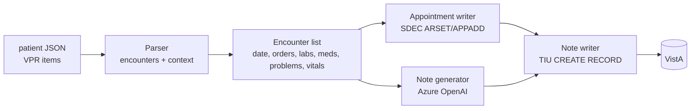

# NotesGenerator – Project Plan

Goal: take a synthetic (Synthea-loaded) VistA patient record, derive historical encounter dates from orders, build a clinical picture from labs/problems/orders, create past appointments on those dates, and write AI-generated synthetic progress notes to VistA for each encounter.

---

## 1. What Exists Today (inventory)

| Asset | What it is | Reuse for |
|---|---|---|
| [patients.txt](patients.txt) | 4 target patients (VEHU, station 500): EBERT178 `100962`, SPINKA232 `100961`, CRIST667 `100964`, ERNSER583 `100965` | Patient loop input |
| [100965.json](100965.json) | vista-api-x `rpc/invoke` response (VPR JSON, `apiVersion 1.01`) for DFN 100965. `payload.data.items[]` = 1159 records keyed by `uid` (`urn:va:<domain>:84F0:<dfn>:<id>`) | Source of encounters + clinical context |
| [vista-notes/](vista-notes/) | Express app; VistaJS RPC broker client; `TIU CREATE RECORD` example; Azure OpenAI client (`gpt-4o`, api-version `2024-02-15-preview`, key in `config.js`) | Note writing (TIU), FileMan date conversion |
| [createAppts/bulk-appointments/](createAppts/bulk-appointments/) | CLI using VistaJS: `SDEC ARSET` -> `SDEC APPADD`, `SDES GET APPTS BY PATIENT DFN3` conflict check | Appointment creation (direct broker) |
| [createAppts/single-appointment-api/](createAppts/single-appointment-api/) | Express app using vista-api-x (`/vista-sites/{site}/users/{duz}/rpc/invoke`) + token server; ARSET/APPADD flow, `SDEC APPSLOTS` | Appointment creation (vista-api-x) |
| `../VAOSAI/openaiClient.js` + `.env` | Azure OpenAI via VA APIM `https://spd-prod-openai-va-apim.azure-api.us/api/openai/deployments/{model}/chat/completions`, header `api-key`, key in `AZURE_OPENAI_API_KEY`. Uses `o3-mini`, api-version `2025-04-28` | **LLM access for note generation** |

### Patient JSON – domain counts (DFN 100965)

| Domain | Count | Key fields |
|---|---|---|
| order | 65 (35 LR, 30 PSO) | `start` (YYYYMMDDHHmm), `name`, `service`, `statusName`, `results[].uid` -> lab uids, `locationName`, `providerName` |
| lab | 157 | `typeName`, `result`, `units`, `low`, `high`, `observed`, `groupUid` (accession) |
| problem | 56 | `problemText` (SNOMED text), `icdCode`, `onset`, `statusName` |
| med | 30 | outpatient meds (map to PSO orders) |
| vital | 241 | BP, weight, BMI, etc. |
| visit | 141 | `dateTime`, `locationName` (GENERAL MEDICINE, loc 23), `stopCodeName` |
| appointment | 113 | `dateTime`, `appointmentStatus`, `localId` = `A;<FMdate>;<locIEN>` |
| immunization / cpt / pov / factor / treatment | 52 / 186 / 14 / 38 / 65 | extra context |
| patient | 1 | demographics (`fullName`, `dateOfBirth`, `genderName`, `veteran`) |

No TIU `document` domain is present, so the patient currently has **no notes**.

### Findings that affect the design

1. **38 distinct order dates** (1980-06-20 -> 2026-07-03). Several orders share a date (e.g. 2025-10-04 has 16 lab orders). One encounter per distinct order *date*.
2. **Every order date already has a `visit`, and most have an `appointment`** (GENERAL MEDICINE, location IEN 23), created by the Synthea load. Dates with a visit but **no** appointment: 1980-06-20, 1986-06-06, 1987-03-12, 2016-10-28, 2025-10-04, 2025-10-21, 2026-04-19. Decision needed: create appointments only where missing, or create new ones in a separate clinic.
3. Orders link directly to lab results via `results[].uid`, so labs can be tied to their encounter without date guessing.
4. Problems are Synthea SNOMED text with placeholder ICD `R69.`; the real clinical picture must come from labs + meds + problem text together. Example: the 2025-10 orders (troponin, BMP, furosemide, carvedilol, lisinopril, later losartan) suggest a cardiac/heart-failure workup that is **not** on the problem list, so the LLM needs to reason from orders/labs.
5. Order `start` and VPR dates are `YYYYMMDDHHmm` and need converting to FileMan (`YYYMMDD.HHMM`, `YYY = year - 1700`). The converter in `vista-notes/index.js` can be reused.
6. There are two LLM configs that don't match (VAOSAI: `o3-mini` @ `2025-04-28`; vista-notes: `gpt-4o` @ `2024-02-15-preview`). **Task 1 checks which one works.**

---

## 2. Target Architecture

App code lives at the repo root (`NotesGenerator/`, Node + pnpm). Modules:

- `loadPatient.js`: reads `<dfn>.json` (later fetches the VPR via vista-api-x).
- `buildEncounters.js`: groups orders by date and attaches linked labs, active meds, problems active on that date, and vitals from that date.
- `aiClient.js`: copied from VAOSAI `openaiClient.js` (dotenv, `AZURE_OPENAI_API_KEY`), with system+user messages.
- `generateNote.js`: builds the prompt and returns note text lines.
- `createAppointment.js`: reuses `createAppts` ARSET/APPADD logic.
- `writeNote.js`: reuses `vista-notes` `TIU CREATE RECORD` logic.
- `index.js`: orchestration with `--dfn`, `--dry-run`, `--limit`, `--only-date`.

---

## 3. Tasks

### Task 1: AI smoke test (FIRST)
Check that the VA Azure OpenAI endpoint will write a synthetic progress note before anything else is built.

- Create `test-ai.js` at the repo root (a single file with no VistA dependency).
- Load `AZURE_OPENAI_API_KEY` from `../VAOSAI/.env`. Do not copy the key or log it.
- Pull **one** encounter out of `100965.json` by hand (suggest **2025-10-21**: BMP, furosemide, carvedilol, lisinopril, plus 2025-10-04 labs as recent history).
- Send a system prompt ("You are generating SYNTHETIC clinical documentation for a VA test system; the patient is fictional...") and a user prompt made from compact JSON of the encounter data. Ask for a SOAP-format outpatient progress note in plain text, lines at most 80 chars (TIU line limit), with no markdown.
- Try deployments/api-versions in order and report which ones succeed:
  1. `o3-mini` @ `2025-04-28` (known working in VAOSAI)
  2. `gpt-4o` @ `2024-02-15-preview` (vista-notes config)
- Print: HTTP status, model, latency, token usage, the note, and whether any content-filter or refusal happened.
- **Exit criteria:** at least one model returns a coherent, clinically plausible note grounded in the provided data, with no refusal. Record the chosen model/api-version.

**Status: DONE (2026-09-29).** OpenSpec change `ai-note-smoke-test`, script [test-ai.js](test-ai.js).
- **Working model:** `o3-mini` @ `2025-04-28`. No refusal and no content-filter block. About 12-19 s per note, about 5-7k tokens (about 2.8k prompt).
- `gpt-4o` @ `2024-02-15-preview` returns **404: that deployment doesn't exist** on the VA APIM, so it's not an option unless another deployment name turns up.
- The note met every format rule (marker line, 6 headings in order, max line 77, no markdown). All cited lab values matched the context.
- Reusable pieces for the real app: VPR indexing, date helpers, minimized context builder, identifier-leak guard, prompt builder, candidate caller/classifier, format checker.
- **Quality gaps found:** see Task 3, "Findings from the smoke test".

### Task 2: Encounter extraction
**Status: DONE (implemented).** OpenSpec change `add-encounter-extraction`: [extract-encounters.js](extract-encounters.js), [src/encounters.js](src/encounters.js), [src/problem-rules.json](src/problem-rules.json). DFN 100965 gives 38 encounters (7 without appointments), with deterministic output in `output/encounters-100965.json`.

- Parse VPR items by domain from `uid`.
- Encounter key = order `start` date (YYYYMMDD); time = earliest order time that day.
- Attach: orders that day; labs from `order.results[].uid` (fallback: lab `observed` same day); meds whose order started that day plus meds active on that date; problems with `onset <= date` (dedupe by text); vitals that day; the existing visit/appointment on that date (for dedupe).
- Classify problems (from the smoke test): Synthea marks almost every problem `ACTIVE`, including ones that ended decades ago. Split them into:
  - **chronic/clinical**: keep
  - **acute/self-limited** (sprain, pharyngitis, sinusitis, cystitis, fracture): drop when onset is more than 1 year before the encounter
  - **social determinants** (employment, education, housing, criminal record, isolation, abuse/violence): send as `socialHistory`, not as problems
- Record the visit type separately (e.g. new, follow-up, acute) so the model doesn't mistake the `setting` field for it.
- Output `encounters-<dfn>.json` and review it by hand.

### Task 3: Prompt design and note quality
- Marker line: include `*** SYNTHETIC TEST NOTE - FICTIONAL PATIENT - NOT FOR CLINICAL USE ***` in the prompt (so LLM includes it) but **strip it on VistA upload** (TIU CREATE RECORD must not contain it).
- Give the prompt a running history: a short summary of previous encounters, so notes are consistent over time and the patient ages correctly (use DOB).
- Choose note title per encounter (default `PRIMARY CARE VISIT` IEN 16; confirm IENs on VEHU).
- Guardrails: don't invent labs that aren't provided; mark abnormal values against `low`/`high`; plain text, at most 80 chars/line.
- Batch-generate for DFN 100965 in dry-run mode and review.

**Status: DONE (2026-09-29).** OpenSpec change `improve-note-quality` implemented and validated.
Enhanced prompts to use `visitDiagnoses`, `carePlanActivities`, and filtered problems; tested on 2025-10-21 encounter.
- Added `filterProblemsForEncounter()` to `src/encounters.js` (filters to primary diagnosis + acute + up to 3 relevant chronic).
- Updated `test-ai.js` prompt to include diagnosis codes, care plan activities, and relevant problem list with explicit constraint "Do NOT include problems outside the provided list".
- Added `stripMarkerLine()` and `validateNote()` functions; creates both marker-present (audit) and marker-clean (upload) versions of each note.
- Quality validation: **7/8 checks passed** (primary diagnosis grounded, narrative coherent, assessment focused ≤4 items, care plan integrated, social history separated, no markdown/IDs, all headings present, max line 73).
- All 6 quality issues from the smoke test are resolved: diagnosis I50.1 surfaces correctly, narrative is coherent, assessment is focused, care plan activities are integrated, visit type is explicit, social history is in SUBJECTIVE.
- See `TASK-3-IMPLEMENTATION-RESULTS.md` for before/after comparison and lessons learned. Ready for Task 4.

**Findings from the smoke test.** These requirements go into the Task 3 spec. See `output/smoke-note-o3-mini.txt` for the first note.
1. **ASSESSMENT is limited to the problems this visit addresses.** ✓ FIXED via `filterProblemsForEncounter()`.
2. **Infer the working diagnosis from orders and new meds.** ✓ FIXED by passing `visitDiagnoses` with ICD codes to prompt.
3. **Add a SOCIAL HISTORY line** (inside SUBJECTIVE) for social determinants, instead of numbered problems. ✓ FIXED via encounter extraction separation.
4. **Visit type comes from a fixed list** (`New patient`, `Follow-up`, `Acute`, `Annual/preventive`), chosen from the data. ✓ FIXED via `suggestedVisitType` in prompt.
5. **Continuity:** the running history across encounters (above) keeps problems and meds consistent between notes. → Deferred to Task 6 (batch generation).
6. **Keep the smoke-test guards** in the real generator: identifier-leak check, format check (marker, headings, <=80 chars, no markdown), and cited-lab grounding. ✓ Enhanced.
7. **Budget:** o3-mini takes 12-19 s and about 6k tokens per note, so 38 encounters x 4 patients is about 150 notes, about 1M tokens, about 45 min sequential. ✓ Confirmed with improved note generation.

### Task 4: Appointment creation for past dates — DONE
- Dedupe policy: skip dates that already have an appointment (`src/appointments.json` tracks created records for idempotent re-runs).
- Reused `SDEC ARSET` -> `SDEC APPADD` via `src/appointmentCreator.js` (shared by smoke test and batch script). Real clinic: IEN 532, resource IEN 185 (site-specific, configurable via `.env`).
- Transport: vista-api-x (`src/vistaApiClient.js`), auth via PIV card exe (`src/tokenService.js` + `sts-token/sts-token-generator.exe`), not an HTTP token server.
- **Overbook flag**: historical dates don't have a slot template in VistA, so APPADD's overbook param defaults to `true` for any date before today (auto-detected in `defaultOverbook()`).
- **Time rounding**: encounter times are rounded backward to the nearest half-hour (`roundDownToHalfHour()`, e.g. `12:24` -> `12:00`) to land on a plausible clinic slot.
- All 7 missing appointments created for DFN 100965 (1980-06-20, 1986-06-06, 1987-03-12, 2016-10-28, 2025-10-04, 2025-10-21, 2026-04-19); IENs logged in `src/appointments.json`.
- See `openspec/changes/create-past-appointments/` for full spec/design/tasks.
- **Follow-up**: re-fetch the full VPR JSON (`{dfn}.json`) from vista-api-x after appointment creation so `output/encounters-{dfn}.json` reflects VistA's authoritative appointment date/time/location, instead of relying solely on our own `src/appointments.json` log (see Task 5 lesson learned below). Same `rpc/invoke` call that produced the original `100965.json`.

### Task 5: Note writing to VistA — SMOKE TESTED
- `TIU CREATE RECORD` with DFN, title IEN, and location IEN; `TEXT` lines from the AI output; visit string `<locIEN>;<FMdate>;<type>`.
- Past encounters: use visit type `E` (historical) if no appointment/visit is linked, or `A` tied to the created/existing appointment time. Check both on one date first.
- Unsigned by default; optional `TIU SIGN RECORD` behind `--sign` flag (`test-write-note.js`).
- Log DFN, date, appointment IEN, and TIU IEN to `src/notes.json` so reruns are idempotent (batch script still to be built, see tasks.md Group 3).
- **Correct RPC param format (vista-api-x)**: `TIU CREATE RECORD` params must be wrapped `{string: ...}` / `{namedArray: {...}}` — a bare JS object is silently corrupted to `"[object Object]"` by `vistaApiClient.js`'s normalizer unless pre-wrapped. Context is `OR CPRS GUI CHART` (not `SDECRPC`). Params: DFN, note title IEN, VDT (blank), VLOC (blank), blank, `namedArray` (`1202`=DUZ, `1301`=note FM datetime, `1205`=location IEN, `1701`=blank, `\r"TEXT",N,0`=body lines), visit string, SUPPRESS (`1` to suppress the "missing encounter info" prompt that blocks signing), NOASF (`1`).
- **Lesson learned (visit linking)**: the visit string's FM datetime must exactly match the appointment's actual date/time, or VistA creates a *new* encounter instead of linking to the existing appointment. `src/notesClient.js`'s `resolveAppointment()` reads the authoritative appointment `dateTime` straight from the encounter's `existing.appointments[0]` (fresh VPR data) rather than trusting a locally-tracked/rounded guess.
- **Lesson learned (FileMan time format)**: VistA drops trailing zeros from the time portion of FM datetimes (e.g. `.1000` -> `.1`, `.1130` -> `.113`, `.0230` -> `.023`). `filemanDateTime()`/`filemanFromVprDateTime()` strip them via `stripTrailingZeros()`.
- **Lesson learned (signing requires encrypted e-sig)**: `TIU SIGN RECORD` rejects a plaintext e-sig code ("incorrect Electronic Signature Code") — the code must be obfuscated with the XWB RPC broker's substitution cipher first. Ported `buildEncryptedSigString()` (20-entry `CIPHER_PAD`, random assoc/id pad indices) from `vista-notes/VistaJSLibrary.js` into `src/notesClient.js`.
- **Lesson learned (sign result codes)**: `TIU SIGN RECORD` returns `"0"` (or empty) on success, not `"1"`; any other text is the error message (e.g. `89250005^You have entered an incorrect Electronic Signature Code...`).
- Verified end-to-end: unsigned note created and signed successfully for DFN 100965 / 2025-10-04 (TIU IEN 5272).

### Task 6: Orchestration and scale-out
- CLI: `node index.js --dfn 100965 --dry-run`, then live.
- Fetch VPR JSON for the other 3 patients (100961, 100962, 100964) through vista-api-x, using the same call that produced `100965.json`.
- Throttle LLM calls (handle 429) and back off/retry for RPC connection resets.

**Status: IN PROGRESS.** See [README.md](README.md#pipeline) for the full step-by-step pipeline (this replaced the planned single `index.js` orchestrator with discrete, idempotent CLI scripts — easier to monitor/debug/resume than one monolithic run).

- **`fetch-vpr.js`** (new): fetches `<dfn>.json` via vista-api-x `VPR GET PATIENT DATA JSON` (context `CDSP RPC CONTEXT`, `namedArray: {patientId}`), replacing the manual export step. Added `raw` and `timeout` options to `src/vistaApiClient.js` to support it (VPR payloads are large and the caller needs the full `{path, payload}` response shape, not just the extracted `.payload`).
- **`resign-notes.js`** (new): re-signs notes that were created but failed to sign (by `tiuIen`), for the ~5% intermittent "incorrect Electronic Signature Code" failures. `src/notesClient.js`'s `signNote()` also now retries internally (2 extra attempts with fresh random cipher indices) before giving up.
- **DFN 100965**: all 38 notes generated, reviewed, approved, and signed.
- **DFN 100961**: VPR fetched (49 encounters, much smaller than 100965's implied volume was expected); appointments created for the 23 encounters missing one; VPR re-fetched/re-extracted; note generation in progress as a trial before processing the larger patients.
- **DFN 100962** (253 encounters) and **100964** (104 encounters): VPR fetched; not yet processed further — scope/cost confirmation needed before running the full generate+sign pipeline given the much higher encounter counts than 100965.

### Task 7: Future and planned encounters (after Tasks 2-5)
- Generate `kind: "planned"` encounters in the same layout as the extracted ones, starting from the latest historical encounter: follow-up interval, labs due, med refills.
- Scope to be decided: (a) booked future appointments only, with no note; (b) new visits dated today or recently, with notes, to simulate ongoing care; or (c) both.
- Future appointments have no check-in and no signed note until the visit date passes.

### Task 8: Pipeline orchestration/visibility (proposed, not started)
Friction noticed while running the 9-step manual pipeline (see README.md#pipeline)
across 4 patients: easy to forget/reorder a step, no single view of where a
patient stands, encounter-count surprises only found after fetching VPR data.
- `pipeline-status.js --dfn <dfn>`: report VPR fetched?/encounters extracted?/#
  missing appointments/# in review vs ready vs signed, per patient.
- `run-pipeline.js --dfn <dfn>`: automate steps 1-4 (fetch, extract, create
  appointments, re-fetch/re-extract) since they require no human judgment;
  stop before generate-notes for a manual go/no-ahead once scope is known.
- Candidate for a proper `openspec propose` once the current 4-patient batch
  (Task 6) is done, so the design reflects real usage pain rather than guesses.

---

## 4. Open Questions
1. Create appointments only on dates without one, or on every order date?
2. Which clinic/location and which note title(s)?
3. Should notes be signed, and as which user/DUZ?
4. Transport: VistaJS broker (access/verify) or vista-api-x (token)?
5. Is `o3-mini` acceptable for note quality, or is a `gpt-4o`/`gpt-4.1` deployment available on the APIM?
6. Future encounters (Task 7): appointments only, notes for new visits, or both?
7. The patient has 141 VistA visits but only 38 order dates. Should visits without orders (for example prenatal visits with a pregnancy test and antenatal care-plan activities) also become encounters with notes?

## 5. Security Notes
- The API key stays in `VAOSAI/.env` (or a local `.env` that is git-ignored). Never log or commit it.
- The data is synthetic (Synthea/VEHU), but still send only the minimum needed fields to the LLM. Leave out SSN, address, and telecom.
- Every generated note should start with a line marking it as synthetic test data.
