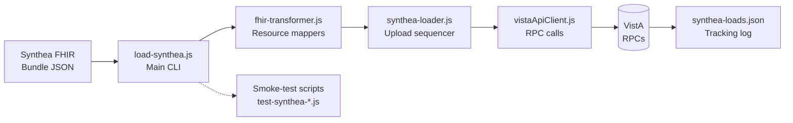

# Design

## Architecture



## RPC Source of Truth

All RPC names, parameters, and behavior below are taken from the **VistA-DataLoader** repo's
verified documentation (`Documentation/RPCs/*.md`, package `VISTA DATALOADER` v3.1, namespace
`ISI*`), not invented. See:
https://github.com/WorldVistA/VistA-DataLoader/tree/master/Documentation/RPCs

This is the same RPC set used internally by VistA-FHIR-Data-Loader — we're calling the identical
RPCs directly instead of going through its Excel/menu-driven import flow.

**Important finding — appointments**: `ISI IMPORT APPT` (`APPMAKE^ISIIMPR1`) writes appointments
directly into the `APPOINTMENT` subfile of file #44 via `APPOINT^ISIIMP04`. This is the **older**
direct-file-write scheduling path, not the newer SDEC/SDES scheduling API
(`SDEC ARSET`/`SDEC APPADD`) that our own `src/appointmentCreator.js` (Task 4) already uses
correctly. This matches the user's observation that "the old FHIR data loader does appointments
wrong." **Decision: do NOT use `ISI IMPORT APPT` for appointments.** Reuse our existing
`src/appointmentCreator.js` (SDEC ARSET → SDEC APPADD) instead; it also auto-creates the linked
outpatient encounter when the note is written (see Task 5's visit-string logic), so there's no
separate "create encounter" RPC needed in our pipeline.

**Superseding finding — VistA-FHIR-Data-Loader internals**: Reviewing the actual
`VistA-FHIR-Data-Loader` source (`SYNFPRB.m`, `SYNFLAB.m`, `SYNFPAN.m`, `SYNFMED.m`, `SYNDHP62.m`)
shows it mostly does **not** call the `ISI IMPORT *` RPCs above — it has its own, more complete
domain logic (`PRBUPDT^SYNDHP62` for problems, `LABADD^SYNDHP63` for individual labs, a full
RxNorm→VUID→VA-Product→Drug-File pipeline in `SYNFMED.m` for meds, and `APPTADD^SYNDHP62` — which
confirms the direct-file-write appointment bug independently). The **only** domain that uses the
real DataLoader RPC is **lab panels**, via `SYNFPAN.m` calling `ISI IMPORT LAB PANEL`
(`LABPANEL^ISIIMPR2` → `LAB^ISIIMP12`, using `PMEM^ISIIMPU7` to check panel membership).

Critically, `wsPostFHIR^SYNFHIR` is a single entry point that runs the **entire** per-patient load
(patient, problems, meds, vitals, labs+panels, immunizations, allergies, encounters, careplans) in
one call, reusing all of this tested domain logic — it's what the `SYNMENU` → `Load Patients from
Filesystem` option and the `POST addpatient/*` web-service handler both call internally.
**Decision: prefer calling `wsPostFHIR^SYNFHIR` (via one custom RPC, see "Payload Transport"
below) over reimplementing `ISI IMPORT PROB`/`MED`/`VITALS`/`LAB` transformers ourselves** — it
reuses far more tested mapping logic (RxNorm drug resolution, LOINC panel detection, SNOMED→ICD
lookups) than we could reasonably rebuild. The per-domain `ISI IMPORT *` tables below remain
useful background/fallback reference (e.g., if `wsPostFHIR` can't be reached or a VistA admin
prefers an incremental per-domain RPC approach instead of one custom wrapper), but are no longer
the primary plan.

## Payload Transport: Custom RPC Wrapping `wsPostFHIR^SYNFHIR`

`wsPostFHIR^SYNFHIR` is only exposed today via a GT.M-native HTTP listener (`POST addpatient/*`,
`docs/web-service-entries.txt`), which doesn't translate to an InterSystems IRIS Web Gateway
without custom CSP/REST mapping work. Since we already have RPC Broker access via vista-api-x,
the simpler path is one **custom RPC** that forwards a chunked JSON payload to
`wsPostFHIR^SYNFHIR` directly.

**IMPLEMENTED (2026-10-02):** RPC `CDSP UTIL LOAD FHIR` (#5024), routine `CDSPFHIR` tag `LOAD` in the
`cds-vista-routines` repo (the `VAOS`/`VAOSFHIR` names and the draft routine below are superseded).
Differences from the draft: JSON-only returns (`{"ERROR":"..."}`), fail-closed pre-checks
(`$$PROD^XUPROD` non-production, SYN routines present), `$ETRAP` handler, broker context
`CDSP RPC UTILS`, and `ARRAY` return. If one request proves too large, the fallback is a staged
upload (stage RPC appends chunks to `^TMP`, a second RPC processes them).

### Verified `wsPostFHIR` signature (read directly from `SYNFHIR.m` source)
```
wsPostFHIR(ARGS,BODY,RESULT,ien)
 ; ien is for internal calls to this routine, and is the ien in the graphstore
 ; for the decoded json — omit it (or pass "") for a fresh external call
 ...
 i $g(ien)="" d  ; not called internally (our case)
 . set ien=$order(@root@(" "),-1)+1
 . set gr=$name(@root@(ien,"json"))
 . merge json=BODY
 . do DECODE^XLFJSON("json",gr)
 . s @root@("filename",ien)=""
 . kill BODY  ; remove it from symbol table as it is too big
 ...
 do importPatient^SYNFPAT(.return,ien)
 ... (labs, vitals, encounters, immunizations, conditions, allergy, appointment, meds,
      procedures, careplan — all run automatically if patient creation succeeded)
 do ENCODE^XLFJSON("return","RESULT")
 quit 1
```

**Key finding — `BODY` is already expected to be chunked, the same way we need it:** when called
externally (no `ien`), `wsPostFHIR` does `merge json=BODY` then `DECODE^XLFJSON("json",gr)` — this
is VistA Kernel's standard convention for a JSON string too large for one M string: the caller
passes it as an array of sequential pieces (`BODY(1)`, `BODY(2)`, `BODY(3)`, ...), not one
pre-concatenated string. This is the exact same convention the interactive file loader uses via
`^TMP("SYNFILE",$J,n)` (filled by `FTG^%ZISH`, which reads a file into sequential numbered nodes).
**This means our custom RPC likely doesn't need to manually reassemble the chunks into one string
at all** — it can pass the received chunk array straight through as `BODY`, as long as our chunk
keys are plain sequential integers (`"1"`, `"2"`, `"3"`, ...) matching what `merge`/`DECODE^XLFJSON`
expect, not the zero-padded scheme from the earlier draft.

**This also answers "does it return results, or do we need another RPC to fetch them?"**
`wsPostFHIR` returns the full per-domain load summary synchronously via `RESULT` (built by
`ENCODE^XLFJSON("return","RESULT")` — the same JSON structure the interactive loader decodes and
prints as the Loaded/Error table). **No second call is needed for the main load flow.** Two
separate read-only routines exist in `SYNFHIR.m` that *could* be wrapped in additional custom RPCs
later if we want to re-query status/audit after the fact (not needed for v1):
- `wsLoadStatus(rtn,filter)` — re-fetches a previously-loaded patient's load status by `ien`/`dfn`
- `getIntakeFhir(rtn,id,type,ien,plain)` — re-fetches the raw FHIR JSON that was stored for a patient

**Appointments confirmed to run automatically**: `wsPostFHIR` unconditionally calls
`importAppointment^SYNFAPT` (→ `APPTUPDT^SYNDHP62`, the broken direct-file-write path) whenever
patient creation succeeds — there's no `ARGS` flag visible to skip it. **Mitigation: omit
`Appointment` resources from the bundle JSON we send** — `SYNFAPT`'s loader only acts on entries
of `resourceType: "Appointment"` it finds in the bundle, so if none are present it loads zero and
does nothing (confirmed by the `importXxx^SYNFxxx(.return,ien,.ARGS)` pattern iterating the parsed
bundle's indexed resource types). `Encounter` resources can still be included — appointments and
notes are created separately by our own `src/appointmentCreator.js` + Task 5's note pipeline.

### Payload size layers (recap)
1. **vista-api-x**: `namedArray` has no `@Size` validation (`RpcInvoker.java`); WildFly/Undertow
   defaults to a 10MB max-post-size (no override in any environment's `standalone.xml`) — fine for
   a per-patient bundle.
2. **M-side per-chunk/string limits**: untested from source — needs an empirical check once the
   routine exists (see Testing plan below).

### Chunking contract (revised — matches the native convention, no manual reassembly)
**Client side** (`src/synthea-loader.js` or a new `src/synthea-transport.js`):
```javascript
function chunkBundleJson(jsonText, chunkSize = 4000) {
  const chunks = {};
  let i = 1; // sequential integers starting at 1, matching XLFJSON's long-string convention
  for (let start = 0; start < jsonText.length; start += chunkSize) {
    chunks[String(i)] = jsonText.substr(start, chunkSize);
    i++;
  }
  return chunks;
}

await vistaApiClient.callRpc(
  'VAOS SYNFHIR LOAD',
  [{ namedArray: chunkBundleJson(bundleJsonText) }],
  'XOBV VISTALINK TESTER', // or whatever context the custom RPC is registered under
  { timeout: 60000 }
);
```
- Start with chunk size `4000`; this is conservative and should be pushed higher once the M-side
  per-entry ceiling is confirmed empirically.
- Strip `Appointment` resources from the bundle JSON client-side before chunking (see above).

**VistA side** (custom RPC — simplified now that `wsPostFHIR` does its own chunk handling):
```
VAOSFHIR ;Custom RPC: forward chunked FHIR bundle to wsPostFHIR^SYNFHIR
LOAD(RESULT,BUNDLECHUNKS) ;RPC entry point, param 1 = namedArray/array of JSON text chunks
    ; BUNDLECHUNKS arrives as BUNDLECHUNKS(1), BUNDLECHUNKS(2), ... (sequential, from client)
    NEW ARGS
    NEW % SET %=$$wsPostFHIR^SYNFHIR(.ARGS,.BUNDLECHUNKS,.RESULT)
    QUIT
```
This is now a thin pass-through — `wsPostFHIR` handles the `merge`/`DECODE^XLFJSON`/`ien`
assignment internally when `ien` is omitted. **Still needs verification by the VistA programmer
before trusting this**:
1. Confirm `wsPostFHIR` is a public label (callable from a different routine, not private to
   `SYNFHIR.m`) — if private, a tiny public shim inside `SYNFHIR.m` itself (or a KIDS patch) may be
   needed instead.
2. Confirm `merge json=BODY` really does accept a Broker-delivered `namedArray`/`array` param
   as-is (VistaLink's array param type arrives as a local array with whatever subscripts were
   sent — should match, but verify with a small hardcoded test first, independent of the RPC
   Broker, directly from a VistA terminal: `D ^XUP`, then manually set a 2–3 node test array and
   call `wsPostFHIR` by hand to confirm the chunk/subscript semantics before wiring up the broker).
3. Confirm the per-chunk size ceiling empirically (start small, increase).

**Status (2026-10-01): items 1-2 confirmed via direct terminal testing (Task 1.5).** `wsPostFHIR`
is public and callable directly; multi-chunk `BODY(1)`/`BODY(2)` reassembly via `merge`+
`DECODE^XLFJSON` works as expected with sequential integer keys. See `tasks.md` Task 1.5 for full
test notes, including a found systemic bug class (missing `$G` guards in several `SYNF*.m` import
wrappers when a resource type is entirely absent — not expected to affect real patient loads).

### Response handling
**CORRECTED (confirmed via terminal testing, 2026-10-01): `RESULT` comes back chunked the same way
as `BODY`** — `RESULT(1)`, `RESULT(2)`, ... — not a single string as originally assumed. Node-side
response parsing must reassemble `RESULT(n)` in order before JSON-parsing it, mirroring exactly
how `BODY` chunks are sent. The content itself is still just the compact per-domain summary
(counts loaded/errors per type), not the full bundle — it only needs chunking because the summary
can still exceed a single RPC string-return size for patients with many domains/errors.

### Testing plan (incremental, per Task 1/5 smoke-test pattern)
1. One `Condition` resource in a minimal valid `Bundle` (few chunks) — prove reassembly +
   `wsPostFHIR` call works end-to-end before scaling up.
2. A handful of resources (~20–50) across domains.
3. A full single-patient bundle, watching for: IRIS/Caché string-size errors, RPC Broker timeout
   (full domain load — RxNorm lookups, panel detection — may be slow; raise `timeout` beyond the
   default), and vista-api-x's own per-request timeout config.

## Verified Against Real Synthea Output (Task 1)

Full findings in [`docs/SYNTHEA-FHIR-STRUCTURE.md`](../../../docs/SYNTHEA-FHIR-STRUCTURE.md).
Four corrections to the assumptions in this design:

1. **CORRECTED (see "Real Appointment Root Cause" below) — `Appointment` resources never exist in
   Synthea's output, but this does NOT mean appointments are avoided.** Originally assumed
   `importAppointment^SYNFAPT` (which only fires on literal `Appointment` resources, and therefore
   never fires) was the only appointment-creation path. **It is not** — see below for the real
   mechanism, found by inspecting an actual VistA load log.
2. **Medication resource is `MedicationRequest`**, not `MedicationStatement`. It carries RxNorm
   codes directly (`medicationCodeableConcept.coding[0]`, system
   `http://www.nlm.nih.gov/research/umls/rxnorm`) — good news, since `wsPostFHIR` routes meds
   through `SYNFMED2.m`'s RxNorm→VUID→Drug-File pipeline, not `ISI IMPORT MED`'s exact-SIG-match
   requirement, so the DRUG/SIG dictionary-matching risk originally flagged is much lower via this
   path (only relevant if ever falling back to standalone `ISI IMPORT MED`).
3. **Blood pressure is one Observation with a `component[]` array** (systolic + diastolic
   together), not two separate Observations needing matching/combination — simpler than planned.
4. **Lab panel gap**: Synthea groups panel results via `DiagnosticReport.result[]` references, but
   `SYNFPAN.m`'s panel-detection logic scans for a panel-coded `Observation` entry directly — which
   doesn't exist in this Synthea version's output. As a result, `SYNFPAN.m` likely won't fire, and
   all labs will load individually via `SYNFLAB.m` instead of being grouped into VistA's LAB PANEL
   file. Needs a decision (see `SYNTHEA-FHIR-STRUCTURE.md` for options) before panels work as
   originally intended — flagged for discussion with whoever maintains `VistA-FHIR-Data-Loader`.

## Real Appointment Root Cause (found via live VistA load-log inspection)

A VistA `SYN LOAD LOG` screenshot for a previously-imported patient (100962) showed an `APPT`
status nested **inside the `encounters` load entry itself**:
```
--status
  --loadstatus loaded
  --return 1^12550
    --APPT -1^Clinic inactive on appt. date (#44).
```
This revealed the real mechanism: `importEncounters^SYNFENC` calls `ENCTUPD^SYNDHP61`
(verified in source), which **unconditionally** does this for every single `Encounter` loaded —
no `ARGS` flag to skip it:
```
; (encounter/visit creation via DATA2PCE^PXAI succeeds first, e.g. "1^12550")
;change APPTDATE back to HL7 format for these next calls
S APPTDATE=$$FMTHL7^XLFDT(APPTDATE)
;create appointment
D APPTADD^SYNDHP62(.RETSTA,DHPPAT,CLINIC,APPTDATE,DHPLEN)
QUIT:$G(RETSTA("APPT"))'=1
;check-in appointment
D APPTCKIN^SYNDHP62(.RETSTA,DHPPAT,CLINIC,APPTDATE,DHPCIDT)
QUIT:$G(RETSTA("CKIN"))'=1
;check-out appointment
D APTCKOUT^SYNDHP62(.RETSTA,DHPPAT,CLINIC,APPTDATE,DHPCODT)
```
**Every encounter load attempts the same broken direct-file-write appointment path
(`APPTADD^SYNDHP62`, file #44/#2.98) using a statically-mapped clinic
(`$$MAP^SYNQLDM("OP","location")` — a fixed config value, not derived per-encounter from FHIR
location data) and the encounter's own date/time.** If it succeeds, the appointment is
**automatically checked in and checked out** too. If the mapped clinic happens to be inactive on
that historical date, only the appointment/check-in/check-out steps fail — the encounter/visit
itself (file #9000010) still loads successfully. This exactly matches what the user observed:
encounters all loaded, but "a small number of appointments" were missing — precisely the ones
whose clinic was inactive on that date, following the exact same shape as our own Task 4 finding
("N of M encounters missing appointments" per patient).

**There is no way to avoid this by filtering bundle content** (no `Appointment` resources to
strip — the trigger is `Encounter`, which we must load). Two real options:

**Option A (recommended) — patch `ENCTUPD^SYNDHP61` to skip the auto-appointment block.**
Since the user owns/maintains this VistA-DataLoader-adjacent codebase and is already deploying one
custom RPC (Task 1.5), adding a small, surgical change to make the `APPTADD`/`APPTCKIN`/`APTCKOUT`
block conditional (e.g., gated on a new optional parameter, defaulting to "skip") is a
comparably small lift. This makes `importEncounters^SYNFENC` only create the visit record, and we
create 100% of appointments ourselves via the already-correct `src/appointmentCreator.js` (SDEC
ARSET/APPADD, Task 4) — consistent behavior for every encounter, no partial-failure gaps, no
auto-checkout surprises interacting with Task 5's visit-linking logic.

**Option B (fallback, no VistA-side code change) — accept it, backfill the gaps.** Let
`ENCTUPD^SYNDHP61` attempt its broken-path appointment on every encounter; afterward, re-fetch VPR
and run `src/appointmentCreator.js` only for encounters still missing an appointment — the exact
same pattern Task 4 already uses today. Downsides: appointments that *did* succeed used the wrong
(old, non-SDEC) method the user originally flagged as broken, and are pre-checked-out, which may
not match what Task 5's note-writing visit-linking logic expects (worth testing explicitly before
relying on this path for the "successful" ones).

**Recommendation**: pursue Option A given it's not meaningfully more VistA-side work than what's
already planned for Task 1.5's RPC wrapper, and it produces entirely consistent appointment
creation across every patient/encounter instead of a partial, old-method result needing cleanup.

### Exact patch location for Option A (`ENCTUPD^SYNDHP61`)

**⚠ Verify against the routine actually installed on the target VistA instance before patching —
line numbers below are from the current GitHub master (`src/SYNDHP61.m`); the user's deployed KIDS
build has not been updated in years and may differ (see "RPC Source of Truth" caveats elsewhere in
this doc). Locate by the surrounding code shown, not by line number alone.**

The `ENCTUPD(RETSTA,DHPPAT,STARTDT,ENDDT,ENCPROV,CLINIC,SCTDX,SCTCPT)` label creates the
encounter/visit first (succeeds independently), then unconditionally falls through into the
appointment-creation block. Patch point — insert a `QUIT` immediately after the visit is created,
before the appointment block begins:
```
 S RETSTA=$$DATA2PCE^PXAI("ENCDATA",PACKAGE,SOURCE,.VISIT,USER,$G(ERRDISP),.ZZERR,$G(PPEDIT),.ZZERDESC,.ACCOUNT)
 S RETSTA=RETSTA_"^"_$G(VISIT)
 I $D(ZZERDESC) M RETSTA("ZZERDESC")=ZZERDESC
 I $D(ZZERR) M RETSTA("ZZERR")=ZZERR
 M RETSTA("ENCDATA")=ENCDATA
 ;
 QUIT  ;<<< ADD THIS LINE — stops here, never reaches the appointment block below
 ;
 ;change APPTDATE back to HL7 format for these next calls
 S APPTDATE=$$FMTHL7^XLFDT(APPTDATE)
 ;create appointment
 N DHPLEN
 S DHPLEN=""
 D APPTADD^SYNDHP62(.RETSTA,DHPPAT,CLINIC,APPTDATE,DHPLEN)
 QUIT:$G(RETSTA("APPT"))'=1
 ;check-in appointment
 N DHPCIDT
 S DHPCIDT=""
 D APPTCKIN^SYNDHP62(.RETSTA,DHPPAT,CLINIC,APPTDATE,DHPCIDT)
 QUIT:$G(RETSTA("CKIN"))'=1
 ;check-out appointment
 N DHPCODT
 S DHPCODT=""
 D APTCKOUT^SYNDHP62(.RETSTA,DHPPAT,CLINIC,APPTDATE,DHPCODT)
 ;
 QUIT
```
This is a single-line, additive, easily-reversible patch (no deletions) — the appointment block
remains in the routine, just unreachable. `RETSTA` still returns the visit creation result
(`1^<visitIen>`) exactly as before; only the nested `RETSTA("APPT")`/`RETSTA("CKIN")` entries will
no longer appear in the load log, which is expected and fine (matches "no appointment created"
being `src/appointmentCreator.js`'s job now).

### SNOMED/class → clinic-type routing table (for `src/appointmentCreator.js`, built from real Synthea data)

Derived from `class.code` and `type[0].coding[0].code` distributions actually observed across all
4 Synthea bundles in this repo (1393 encounters total). `SYNQLDM.m`'s own `"encounters"` map
already has commented-out entries for two of these SNOMED codes (`32485007`→IP, `305351004`→ICU),
suggesting this kind of routing was intended but never wired up.

| Bucket | `class.code` | Representative `type[0]` SNOMED codes | Count (this sample) | Action |
|---|---|---|---|---|
| **Primary/General** | `AMB` | `185349003` check-up, `410620009` well-child, `185347001` problem visit, `185345009` symptom visit, `308335008`, `162673000`, `698314001`, `394701000`, `270427003`, `390906007`, `33879002`, `424619006`/`424441002`/`169762003` (prenatal/postnatal) | 1159 | Book via existing primary-care clinic (current `VISTA_CLINIC_IEN`) |
| **Emergency** | `EMER` | `50849002` ER admission, `183460006` obstetric emergency, `183478001` emergency hospital admission for asthma | 45 | Book via a dedicated Emergency Dept clinic (new `VISTA_ED_CLINIC_IEN`) |
| **Urgent Care** | `AMB` (not `EMER`) | `702927004` "Urgent care clinic" | 23 | Book via Urgent Care clinic if one exists, else fold into Primary/General |
| **Inpatient** | `IMP` | `32485007` hospital admission, `305408004` surgical admission, `305336008` hospice admission, `183495009` non-urgent ortho admission | 12 | **Skip outpatient appointment creation** — real inpatient admissions don't get a clinic appointment in VistA; this is a different workflow (ward admission) outside current scope |
| **ICU** | `IMP` | `305351004` admission to ICU | 6 | **Skip outpatient appointment creation** — same reasoning as Inpatient |
| **Telehealth** | `VR` | `448337001` telemedicine consult | 18 | Book via primary-care clinic, consider a different visit-type flag if VistA distinguishes telehealth visits |
| **Home Health** | `HH` | (none distinct) | 1 | Skip — not a clinic visit |

**New config needed** (`.env`): `VISTA_ED_CLINIC_IEN` at minimum (Emergency is the largest non-AMB
bucket at 45 encounters); Urgent Care clinic IEN only if a distinct one exists/is wanted on the
target VistA instance. **VistA admin prerequisite** (same regardless of which code does the
booking): the destination clinic(s) for each bucket must exist in file #44 and be active across
the full historical date range Synthea's output spans (1980–2026 in this dataset).


Synthea outputs FHIR JSON bundles (one file per patient). Each bundle contains:
- `resourceType: "Bundle"`
- `entry[]` array with typed resources: Patient, Condition, Medication, MedicationStatement,
  Observation, Encounter, etc.

Example: `Lawana430_Temple691_Ernser583_...json`

### Load Sequence (per patient)
1. **Parse bundle**: Extract all resources, index by resourceType and id
2. **Patient**: Transform `Patient` resource → `ISI IMPORT PAT` params; call RPC, get back DFN
3. **Problems**: Transform `Condition` resources → `ISI IMPORT PROB` params (per problem)
4. **Medications**: Transform `Medication` + `MedicationStatement` → `ISI IMPORT MED` params
   (per medication order)
5. **Vitals**: Transform `Observation` resources (`category = 'vital-signs'`) → `ISI IMPORT VITALS`
   params (one call per individual vital reading — BP must be combined from separate systolic/
   diastolic readings into one `"120/80"` RATE string)
6. **Labs**: Transform `Observation` resources (`category = 'laboratory'`) → `ISI IMPORT LAB`
   params (one call per result — this RPC creates the order *and* files the result in a single
   call, unlike the two-step flow in the original draft of this design)
7. **Appointments + Encounters**: Reuse `src/appointmentCreator.js` (SDEC ARSET/APPADD, Task 4)
   per `Encounter`/`Appointment` resource — **not** `ISI IMPORT APPT`

### Output
- Uploaded data in VistA (live)
- `synthea-loads.json`: Tracking log with `{sourceBundleFile, sourcePatientId, sourceResourceUid, vistaResourceId, vistaIen, status, uploadedAt, rpcName}` per resource
- Optional dry-run report: JSON with transformed data before upload

## Resource Mapping Details

### Patient → `ISI IMPORT PAT`
**RPC**: `PNTIMPRT^ISIIMPR1`
**Synthea FHIR**: `Patient` resource with `name`, `birthDate`, `gender`, `identifier[]` (SSN/MRN)

| MISC param | Required | Source |
|---|---|---|
| `NAME` | Yes* | `name[0].family`,`given[0]` → `LAST,FIRST` |
| `SEX` | Yes | `gender` → `M`/`F` |
| `DOB` | Yes* | `birthDate` → FileMan date |
| `SSN` | Yes* | `identifier[]` where `type.text` contains SSN (9 digits) |
| `RACE` | No | `extension` (us-core-race) |
| `ETHNICITY` | No | `extension` (us-core-ethnicity) |
| `MARITAL_STATUS` | No | `maritalStatus.text` |
| `STREET_ADD1`/`CITY`/`STATE`/`ZIP_4` | No | `address[0]` |

\* Required unless using `TEMPLATE` or mask values.

**Output**: `ISIRESUL(1) = DFN^SSN^NAME` on success.

### Condition (Problem) → `ISI IMPORT PROB`
**RPC**: `PROBMAKE^ISIIMPR1`
**Synthea FHIR**: `Condition` with `code` (SNOMED), `onsetDateTime`, `abatementDateTime`, `clinicalStatus`

| MISC param | Required | Source |
|---|---|---|
| `PROBLEM` | Yes | `code.coding[0].display` or `code.text` (resolved via Clinical Lexicon #757.01; SNOMED auto-maps to ICD, falls back to `799.9` if unmapped) |
| `PROVIDER` | Yes | **Not in Synthea** — must default to a configured system/service provider (`.env`: `VISTA_DATA_LOAD_PROVIDER`) |
| `PAT_SSN` | Yes | SSN from patient load step (or DFN) |
| `STATUS` | Yes | `clinicalStatus.coding[0].code == 'active'` → `A`, else `I` |
| `TYPE` | Yes | **Not in Synthea** — heuristic: acute/self-limited conditions (see Task 2's classification rules) → `A`; chronic → `C` |
| `ONSET` | No | `onsetDateTime` → FileMan date |
| `RESOLVED` | No | `abatementDateTime` → FileMan date (if present) |

**Heuristic carried over from Task 2**: mark as `STATUS=I` (inactive) if `onset` is more than 1
year before the load date, even if Synthea's `clinicalStatus` says `active` — Synthea marks almost
everything active regardless of real-world resolution.

**Output**: `ISIRESUL(1) = IEN` in PROBLEM file (#9000011) on success.

### Medication + MedicationStatement → `ISI IMPORT MED`
**RPC**: `MEDMAKE^ISIIMPR2`
**Synthea FHIR**: `Medication` (definition) + `MedicationStatement`/`MedicationRequest`
(dosage/status)

| MISC param | Required | Source |
|---|---|---|
| `PAT_SSN` | Yes | SSN/DFN |
| `DRUG` | Yes | `Medication.code.coding[0].display` (must exist in DRUG file #50 — Synthea drug names often won't match VistA's formulary exactly; needs a mapping table or fuzzy match, flagged as an open risk) |
| `DATE` | Yes | `MedicationStatement.effectivePeriod.start` → FileMan date/time |
| `EXPIRDT` | Yes | **Not in Synthea** — derive as `DATE + SUPPLY days` or a fixed default (e.g., 1 year) |
| `SIG` | Yes | Must match an existing entry in MEDICATION INSTRUCTION file (#51) — Synthea's free-text `dosageInstruction[0].text` will often NOT match; needs mapping to closest existing SIG or a pre-loaded custom SIG library |
| `QTY` | Yes | Derived from dose + supply days (Synthea doesn't give this directly) |
| `SUPPLY` | Yes | `dispenseRequest.expectedSupplyDuration` if present, else a default (e.g., 30) |
| `REFILL` | Yes | `dispenseRequest.numberOfRepeatsAllowed` if present, else default (e.g., 0) |
| `PROV` | Yes | Same default-provider issue as Problems |

**Risk flagged for Task 1 exploration**: SIG and DRUG matching against VistA's existing files
(#51, #50) is the highest-risk mapping in this design — Synthea data is free text, VistA requires
exact matches to existing dictionary entries. Needs real investigation against the target VistA
instance's DRUG/MEDICATION INSTRUCTION files before this transformer can be considered reliable.

### Observation (Vitals) → `ISI IMPORT VITALS`
**RPC**: `VITMAKE^ISIIMPR1`
**Synthea FHIR**: `Observation` with `category.coding[0].code == 'vital-signs'`

| MISC param | Required | Source |
|---|---|---|
| `DT_TAKEN` | Yes | `effectiveDateTime` → FileMan date/time |
| `PAT_SSN` | Yes | SSN/DFN |
| `VITAL_TYPE` | Yes | Map LOINC code → `TEMPERATURE`/`PULSE`/`RESPIRATION`/`BP`/`HEIGHT`/`WEIGHT`/`PAIN`/`PO2` (see LOINC table below) |
| `RATE` | Yes | `valueQuantity.value` (BP is a special case — Synthea reports systolic/diastolic as separate Observations or as `component[]`; must combine into one `"120/80"` string for a single `BP` call) |
| `LOCATION` | Yes | Map from `Observation.encounter` → hospital location (fallback: default clinic) |
| `ENTERED_BY` | Yes | Same default-provider pattern as Problems/Meds |

**LOINC → VITAL_TYPE mapping** (from Synthea's standard vital LOINC codes):
- `8310-5` Body temperature → `TEMPERATURE`
- `8867-4` Heart rate → `PULSE`
- `9279-1` Respiratory rate → `RESPIRATION`
- `8480-6` Systolic BP + `8462-4` Diastolic BP → combine → `BP`
- `8302-2` Body height → `HEIGHT`
- `29463-7` Body weight → `WEIGHT`
- `39156-5` BMI → not directly supported by `ISI IMPORT VITALS`; may need to skip or compute separately
- `59408-5` / `2708-6` O2 saturation → `PO2`

### Observation (Lab) → `ISI IMPORT LAB`
**RPC**: `LABMAKE^ISIIMPR2`
**Synthea FHIR**: `Observation` with `category.coding[0].code == 'laboratory'`

| MISC param | Required | Source |
|---|---|---|
| `PAT_SSN` | Yes | SSN/DFN |
| `LAB_TEST` | Yes | `code.coding[0].code` (LOINC, dash format e.g. `"2345-7"`) or `code.text` — must exist in LABORATORY TEST file (#60) |
| `RESULT_DT` | Yes | `effectiveDateTime` → FileMan date/time |
| `RESULT_VAL` | Yes | `valueQuantity.value` (numeric) or `valueString`/`valueCodeableConcept.text` (text results) |
| `LOCATION` | Yes | Map from `Observation.encounter` → hospital location |
| `COLLECTION_SAMPLE` | No | Infer from test type if available (e.g., `BLOOD`, `URINE`) |

**One call per lab result** (not two RPCs as originally drafted) — `ISI IMPORT LAB` both creates
the lab order and files the result in a single call. The RPC includes built-in duplicate detection
(same patient/date/test), so it's naturally close to idempotent, but we still track it in
`synthea-loads.json` for auditability and to skip redundant calls entirely.

**Not in scope for v1**: `ISI IMPORT LAB PANEL` (for grouped panel results) — individual
`ISI IMPORT LAB` calls per result are sufficient for our use case and simpler to reason about.

### Encounter / Appointment → reuse `src/appointmentCreator.js` (SDEC ARSET/APPADD)
**Do NOT use `ISI IMPORT APPT`** (see "RPC Source of Truth" above — it's the old direct-file-write
path the user flagged as broken).

**Synthea FHIR**: `Encounter` (preferred) or `Appointment` resource with `period.start`/`start`,
`location`, `type`

Reuse Task 4's existing logic as-is:
1. `SDEC ARSET { namedArray: { ... } }` → reserve slot
2. `SDEC APPADD { namedArray: { ... } }` → confirm appointment
3. Overbook defaulted `true` for historical dates (`defaultOverbook()`)
4. Time rounded to nearest half-hour (`roundDownToHalfHour()`)

No separate "create encounter" step is needed — Task 5's note-writing pipeline already creates
the linked outpatient encounter via the TIU visit string when a note is written against the
appointment.

## Upload Safety

### Idempotence
- Track loaded resources in `src/synthea-loads.json`: `{ sourceBundleFile, sourcePatientId, sourceResourceUid, vistaResourceId, vistaIen, status, uploadedAt, rpcName }`
- Skip re-uploading if `sourceResourceUid` already exists in the log (check before each RPC call)
- `ISI IMPORT LAB` has server-side duplicate detection (same patient/date/test) as a second line of defense
- If an RPC call fails with an "already exists"-style error, log and continue rather than treating as fatal

### Dry-Run Mode
- Parse all resources, transform to RPC MISC-array params, print the transformed data
- Do NOT call any RPCs
- Show user the data that would be uploaded for review/approval

### Rollback
- **Data cannot be rolled back automatically** — once `ISI IMPORT *` RPCs write to VistA, undoing
  requires manual VistA administrative action
- Log all RPC calls with full MISC-array params and raw responses for audit/review

## Code Structure

### `load-synthea.js` (CLI entry point)
```
node load-synthea.js --input <dir> [--dfn <dfn>] [--patient <id>] [--dry-run] [--verbose]
```

### `src/synthea-loader.js`
```javascript
async function load(bundle, dfn, dryRun, verbose) {
  // Sequencer: Patient -> Problems -> Medications -> Vitals -> Labs -> Appointments/Encounters
  // Each step: idempotence check -> RPC call via src/vistaApiClient.js -> log to synthea-loads.json
}
```

### `src/fhir-transformer.js`
```javascript
// Pure transforms, no RPC calls. Each returns { rpcName, miscParams: [...], sourceUid }
function transformPatient(resource) {...}
function transformCondition(resource, providerDefault) {...}
function transformMedicationStatement(resource, medicationMap, providerDefault) {...}
function transformVitalObservation(resource, locationMap, providerDefault) {...}
function transformLabObservation(resource, locationMap) {...}
```

### Smoke Tests
- `test-synthea-patient.js`: Register one patient via `ISI IMPORT PAT`, fetch via VPR, compare
- `test-synthea-problems.js`: Load via `ISI IMPORT PROB`, fetch via VPR, verify counts + codes
- `test-synthea-meds.js`: Load via `ISI IMPORT MED` — **expect SIG/DRUG mapping failures**, document actual matches found
- `test-synthea-vitals.js`: Load via `ISI IMPORT VITALS`, verify in vitals domain
- `test-synthea-labs.js`: Load via `ISI IMPORT LAB`, verify in results
- `test-synthea-appointments.js`: Load via existing `appointmentCreator.js`, verify in schedule

## Config & Secrets

New `.env` entries:
```
VISTA_DATA_LOAD_PROVIDER=<name-or-ien>   # Default provider for PROB/MED/VITALS RPCs (Synthea has no provider concept mapped to VistA NEW PERSON file)
VISTA_DATA_LOAD_LOCATION=<name-or-ien>   # Default hospital location fallback when Encounter location can't be mapped
```

Reused from existing config:
- `VISTA_API_BASE_URL`
- `VISTA_SITE_ID`
- `VISTA_API_KEY`
- PIV token service exe path
- `src/appointmentCreator.js` config (clinic/resource IENs from Task 4)
